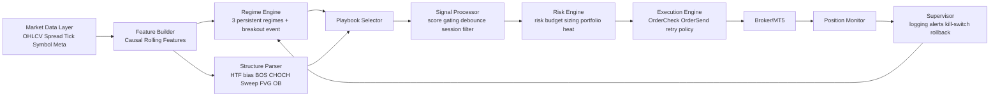
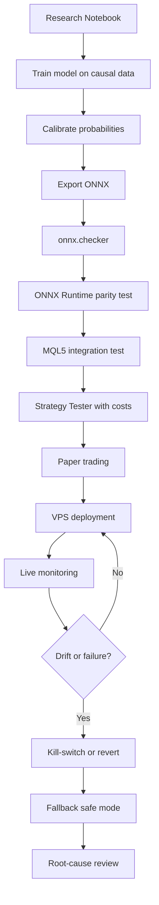

# Khung chuyển hóa research paper thành thiết kế xương sống cho Expert Advisor

## Tóm tắt điều hành

Tài liệu anh upload cho thấy một nhận định rất đúng kiểu quant thực chiến: ý tưởng DRAT-EA đáng build, nhưng bản mô tả hiện tại mới ở mức concept mạnh chứ chưa phải trading system production-ready. Điểm mạnh nằm ở chỗ dùng **regime-aware gating** để ML chỉ làm việc hẹp là nhận diện điều kiện thị trường, còn execution vẫn nằm ở lớp rule-based; điểm yếu nằm ở ontology regime còn lẫn lộn, ICT chưa được formalize thành luật máy đọc được, và validation có nguy cơ “đẹp backtest nhưng hỏng live” nếu sai ngữ nghĩa thời điểm ra quyết định. Tài liệu đó cũng khuyến nghị chuyển từ mô hình 4 lớp độc quyền sang **3 persistent regimes** cộng **1 breakout-event flag** riêng, và formalize ICT thành một state machine rõ ràng. fileciteturn0file0L5-L9 fileciteturn0file0L23-L27 fileciteturn0file0L35-L37

Nếu chuyển tư duy đó sang EA theo chuẩn professional quant, em khuyên kiến trúc đúng sẽ là: **paper/concept → causal feature set → regime engine → playbook selector → signal parser → risk engine → execution engine → supervisor layer**. HMM và các regime-switching models vẫn là nền tảng hợp lý để mô tả trạng thái ẩn của thị trường; các nghiên cứu gần đây cũng nhấn mạnh rằng regime-aware systems có thể cải thiện tính bền vững out-of-sample nếu giữ được tính nhân quả và persistence của state. citeturn22academia3turn38academia1turn38academia2

Về mặt triển khai, đường đi hợp lý nhất hiện nay là **train trong Python**, export sang **ONNX**, kiểm tra bằng `onnx.checker` và **ONNX Runtime**, rồi chạy inferencing trong MT5 bằng `OnnxCreate`/`OnnxCreateFromBuffer`, `OnnxSetInputShape`, `OnnxSetOutputShape`, và `OnnxRun`. MQL5 hỗ trợ test hành vi model trong Strategy Tester; ONNX Runtime thì nhấn mạnh rõ rằng runtime chỉ xác nhận model hợp chuẩn ONNX, còn độ đúng, độ ổn định và sự phù hợp với use case trade là trách nhiệm của người triển khai. citeturn30view0turn3view1turn29view1turn37view2

Về xác thực, phần quan trọng nhất không phải “accuracy cao”, mà là **decision-time correctness**: chỉ dùng completed bars, không centered features, không global normalization sai ngữ nghĩa, không same-bar fantasy fills, và luôn đánh giá theo walk-forward với transaction costs thực tế. Benchmark gần đây về decision-time leakage cho thấy chỉ một thay đổi nhỏ trong protocol đánh giá cũng có thể làm alpha biến mất, đặc biệt khi dùng centered features hoặc fill cùng ngày với thông tin vốn chỉ biết sau khi bar đã hình thành. citeturn25academia0turn21academia0

Điểm chốt để biến paper thành EA không phải là “code lại ý tưởng”, mà là **dịch ý tưởng thành ngôn ngữ hệ thống**: giả thuyết nào được phép, state nào bền, event nào ngắn hạn, feature nào nhân quả, lệnh nào gửi bằng loại order nào, size nào hợp với stop nào, khi nào tắt máy, và ai chịu trách nhiệm khi mô hình drift. Đó là ranh giới giữa một “EA có vẻ thông minh” và một framework có thể vận hành thật. fileciteturn0file0L217-L253 citeturn37view2turn11view4turn12view2

## Đánh giá research paper và nguyên tắc lượng hóa thành EA

Bản review anh upload đã đúng ở ba điểm lớn. Một là **không bắt ML dự đoán giá trực tiếp**, mà dùng nó để trả lời câu hỏi hẹp hơn: “state này có đáng bật playbook này không?”. Hai là **tách regime khỏi execution**, giúp mô hình không phải vừa nhận diện bối cảnh, vừa parse cấu trúc, vừa xử lý lệnh trong một khối đen khó kiểm soát. Ba là đường triển khai **Python → ONNX → MQL5** là hoàn toàn thực tế trên hạ tầng MT5 hiện nay. fileciteturn0file0L13-L19 citeturn30view0turn3view1turn37view2

Tuy nhiên, đúng như tài liệu đã chỉ ra, paper/concept kiểu này thường mắc lỗi “nửa discretionary, nửa machine”. Điểm yếu lớn nhất là **ontology regime chưa sạch**: `trend`, `range`, `high-vol` là trạng thái tương đối bền, còn `breakout` thường là một event ngắn hạn hoặc phase transition. Literature về regime switching mô tả regime như latent states có persistence; trong khi jump-model/regime-signal literature gần đây cũng nhấn mạnh giá trị của state persistence và kỷ luật trong chuyển state. Bởi vậy, nếu ép `breakout` đứng ngang hàng với các state bền trong cùng một softmax mutually-exclusive, label sẽ rất nhiễu. fileciteturn0file0L23-L27 citeturn22academia3turn38academia1

Điểm yếu thứ hai là **paper ngôn ngữ trader, chưa phải ngôn ngữ máy**. Những khái niệm như BOS, CHOCH, liquidity sweep, FVG, order block chỉ hữu dụng cho EA khi mỗi khái niệm có định nghĩa hình học và định nghĩa thời gian cụ thể: dùng swing nào, window nào, ngưỡng ATR nào, tối đa bao nhiêu bar chờ retest, xác nhận bằng close hay wick, session nào được phép kích hoạt. Tài liệu anh upload đã định hướng rất đúng rằng lớp ICT nên được viết như một **state machine** thay vì một tập từ khóa. fileciteturn0file0L35-L37 fileciteturn0file0L57-L77

Điểm yếu thứ ba là **paper chưa khóa chặt semantics đánh giá**. Nếu một feature dùng thống kê của cả sample, nếu nhãn dùng thông tin tương lai chồng lấn lên train, hoặc nếu lệnh được giả định fill ngay trên bar đã dùng để tạo tín hiệu, thì kết quả sẽ bị thổi phồng. Đây không còn là lo ngại lý thuyết; benchmark mới về decision-time leakage cho thấy centered temporal features và same-day-open execution với dữ liệu biết sau open gây inflation rất rõ và rất ổn định. fileciteturn0file0L221-L233 citeturn25academia0

Từ góc nhìn thiết kế EA, cách chuyển paper sang framework nên theo bảng sau.

| Mệnh đề trong paper | Diễn giải kiểu quant | Biến thành module EA |
|---|---|---|
| “Regime-aware” | Một lớp gating chọn playbook theo state bền và event flag | `RegimeEngine` + `PlaybookSelector` |
| “ICT execution” | State machine cấu trúc và thanh khoản, không phải pattern-matching cảm tính | `StructureParser` |
| “Adaptive risk” | Risk budget phụ thuộc regime, spread, volatility, portfolio heat | `RiskEngine` |
| “Deploy trên MT5” | Model artifact phải tương thích ONNX và runtime MQL5 | `ModelAdapter` |
| “Robust backtest” | Walk-forward, next-bar semantics, cost-aware, leakage controls | `ResearchHarness` |
| “Bền khi live” | Logging, alerts, drift checks, kill-switch, rollback | `Supervisor` |

Bản chất của bước này là: **mọi phát biểu trong paper phải được ép thành một interface, một điều kiện, một biến trạng thái, một ngưỡng, hoặc một quyết định có thể kiểm thử**. Nếu một ý trong paper chưa làm được điều đó, nó chưa đủ điều kiện để vào EA.

## Khung kiến trúc EA production

Kiến trúc em khuyên dùng cho loại chiến lược này là **đa lớp nhưng không đa nghĩa**: mỗi module chịu trách nhiệm một việc duy nhất, và đường dữ liệu phải có đúng ngữ nghĩa thời gian.



MQL5 hiện cung cấp toàn bộ khung ONNX cần thiết: tạo session từ file hoặc buffer, set input/output shape, rồi chạy model bằng `OnnxRun`; đồng thời có thể kiểm thử model trong Strategy Tester trước khi live. Phía PyTorch hiện khuyến nghị dùng exporter mới với `dynamo=True`, còn ONNX checker và ONNX Runtime nên được dùng để kiểm tra tính hợp lệ và hành vi inferencing trước khi mang model sang MT5. citeturn30view0turn3view1turn6view1turn29view1turn37view2

### Regime engine

Nếu input ở thời điểm ra quyết định chỉ là một vector feature của bar mới nhất, tài liệu anh upload đúng khi nhận xét rằng **LSTM sẽ overkill**; khi đó tabular models như gradient boosting, random forest, hoặc boosting family thường hợp lý hơn để đi phase đầu. Nếu thực sự dùng sequence model, phải feed đúng tensor tuần tự chứ không được giả sequence bằng vài feature tĩnh. fileciteturn0file0L45-L50

Về production design, em khuyên regime engine có hai output:

- `persistent_regime ∈ {trend, range, stress}`
- `breakout_event_prob ∈ [0,1]`

Persistent regime phục vụ **quyết định được trade kiểu gì**; event flag phục vụ **quyết định được trade ngay bây giờ không**. Cách tách này sạch hơn, khớp hơn với literature về latent states, và ít tự mâu thuẫn hơn việc bắt một bar vừa “breakout” vừa “high-vol” nhưng chỉ được phép chọn một nhãn. fileciteturn0file0L23-L27 citeturn22academia3turn38academia1

### Structure parser và signal processing

Structure parser phải là lớp quyết định “context có đúng không”, còn signal processor quyết định “tín hiệu có đủ sạch để gửi sang risk engine không”. Em khuyên logic vào lệnh theo thứ tự:

1. Xác định **HTF bias** bằng cấu trúc H1/H4.
2. Kiểm tra **session filter**.
3. Tìm **liquidity sweep** hoặc range-expansion event.
4. Chờ **CHOCH/MSS** xác nhận.
5. Yêu cầu giá hồi vào **OB/FVG edge** trong tolerance hợp lệ.
6. Áp thêm **regime gate**.
7. Loại bỏ setup nếu spread/slippage vượt ngưỡng.
8. Chuyển sang risk engine. fileciteturn0file0L67-L77

### Bảng so sánh chỉ báo và feature set nên dùng

Bảng dưới đây không phải “danh sách indicator đẹp mắt”, mà là tập feature có ý nghĩa trực tiếp với một EA regime-gated.

| Nhóm feature | Ứng viên | Dùng khi nào | Ưu điểm | Cảnh báo |
|---|---|---|---|---|
| Xu hướng | EMA slope, ADX, rolling return, breakout distance | Phân biệt trend/range | Dễ giải thích, ổn định | Dễ lag nếu chỉ dùng MA |
| Biến động | ATR, realized volatility, range expansion ratio | Nhận diện stress/high-vol | Liên quan trực tiếp tới sizing và stop | Phải đồng bộ với execution cost |
| Mean-reversion / exhaustion | RSI, z-score distance from session VWAP/rolling mean | Gating trong regime range | Hợp với fade setup | Không nên bật trong breakout event mạnh |
| Persistence | Hurst / fractal dimension | Bổ trợ cho trend persistence | Có thể thêm chiều “roughness” | Cửa sổ ngắn rất nhiễu, đặc biệt intraday fileciteturn0file0L31-L35 |
| Thanh khoản thực dụng | spread, spread z-score, tick arrival rate | Quyết định có trade được không | Cực kỳ quan trọng khi live | Spread có thể nổi; tick volume không đồng nghĩa real volume trên FX/CFD citeturn27view0turn10view0turn31view0 |
| Thời gian | session, hour-of-day, day-of-week, news embargo | Với ICT/session-driven logic | Tăng causal context | Phải normalize timezone nhất quán |
| Cấu trúc | BOS, CHOCH, FVG width, OB distance, sweep flag | Execution layer | Bám sát logic trader | Phải formalize thật chặt fileciteturn0file0L57-L77 |
| Ma sát giao dịch | expected slippage, commission equivalent, fill failure rate | Risk và execution | Giảm backtest fantasy | Phải log theo broker thực tế |

Session/time features đặc biệt quan trọng, vì bản review anh upload nhấn mạnh rằng ICT rất nhạy với khung thời gian thanh khoản và session window; nếu model không biết đang ở Asian drift, London expansion hay NY overlap thì regime từ góc nhìn trading sẽ luôn thiếu một trục thông tin. fileciteturn0file0L51-L53

### Money management, position sizing và execution

Quant giỏi và trader giàu kinh nghiệm giống nhau ở một điểm: **size là một quyết định model-level, không phải phép chia sau cùng**. Em khuyên tách rõ ba lớp:

- **Risk budget**: hệ thống được phép mất bao nhiêu ở lệnh này.
- **Sizing transform**: chuyển risk budget thành lots thực tế.
- **Execution transform**: điều chỉnh lots hoặc hủy lệnh nếu broker friction không đạt.

Công thức triển khai practical:

\[
risk\_budget = Equity \times base\_risk \times regime\_multiplier \times drawdown\_multiplier
\]

\[
effective\_stop\_points = structure\_stop\_points + spread\_buffer + expected\_slippage\_buffer
\]

\[
lots\_raw = \frac{risk\_budget}{effective\_stop\_points \times point\_value\_per\_lot}
\]

\[
lots = round\_down\_to\_step(clamp(lots\_raw, vol\_min, vol\_max))
\]

Ở MT5, broker/symbol constraints phải được đọc trực tiếp từ symbol metadata: spread có thể fixed hoặc floating; từng symbol có volume min/max/step/limit riêng; stop orders bị ràng buộc bởi `SYMBOL_TRADE_STOPS_LEVEL`; thao tác sửa/đóng lệnh còn bị chặn bởi `SYMBOL_TRADE_FREEZE_LEVEL`; và filling modes/order types không phải symbol nào cũng giống nhau. citeturn27view0turn11view1turn11view2turn33view0turn33view1turn33view2turn11view0

## Dữ liệu, tham số hóa và tối ưu hóa

### Yêu cầu dữ liệu

Với chiến lược dạng regime + structure + execution, dữ liệu tối thiểu nên có ba lớp:

| Lớp dữ liệu | Bắt buộc | Nên có | Mục đích |
|---|---|---|---|
| Market bars | OHLC, time, spread | tick replay / M1 để mô phỏng intrabar | signal và backtest |
| Volume/liquidity | tick volume | real volume nếu có | lọc điều kiện, không dùng mù quáng |
| Symbol metadata | point, tick value, min/max/step, stops, freeze, filling mode | margin rates, swaps | sizing và execution thực |

Ở MT5, `iTickVolume` trả về **tick volume của bar**, còn `iRealVolume` trả về **real volume** nếu dữ liệu đó tồn tại. Với Forex/CFD, việc có real volume hay không phụ thuộc nguồn dữ liệu; vì vậy volume-based feature phải được gắn nhãn đúng nghĩa, không được diễn giải tick volume như khối lượng giao dịch exchange chuẩn. citeturn10view0turn31view0

Khuyến nghị engineering của em cho DRAT-style EA là:

- Nếu execution ở **M15**, nên có ít nhất **3–5 năm dữ liệu sạch**, tốt hơn là **5–8 năm** nếu broker-history đủ tin cậy.
- Nếu thêm HTF H1/H4 bias, nên có ít nhất **8–12 năm bars** cho lớp HTF.
- Nếu chiến lược nhạy spread/slippage, nên lưu riêng **spread theo bar** hoặc **tick snapshots**, không chỉ OHLC trần.
- Nên đóng băng **timezone**, **DST policy**, **session mapping**, và **rollover conventions** ngay từ đầu.

Đây là khuyến nghị thiết kế, không phải luật cứng; mục tiêu là đủ mẫu qua nhiều regime, không phải tối đa dữ liệu bằng mọi giá.

### Chuẩn hóa dữ liệu và feature pipeline

Nếu đi theo scikit-learn, `Pipeline` cho phép chain preprocessing và predictor làm một object duy nhất; `StandardScaler` chuẩn hóa theo mean và standard deviation của **training samples**; còn `sklearn-onnx` hỗ trợ convert model hoặc cả pipeline sang ONNX và có tích hợp kiểm tra backend bằng ONNX Runtime. Đây là cách sạch nhất để tránh re-code normalization trong MQL5. citeturn7view4turn7view5turn32view0

Điểm rất quan trọng là chuẩn hóa phải **fit trên train**, không fit trên full sample. Dù benchmark leakage gần đây cho thấy global normalization không phải lúc nào cũng là nguồn inflation mạnh nhất, centered temporal features và same-day-open fills rõ ràng là các lỗ thủng lớn; vì vậy production process vẫn nên giữ kỷ luật causal tuyệt đối. citeturn25academia0

### Hiệu chuẩn xác suất và quyết định ngưỡng

Nếu EA dùng threshold kiểu `p_trend > 0.70` hay `p_breakout > 0.65`, thì probability đó bắt buộc phải được **calibrate**. Scikit-learn hiện hỗ trợ `CalibratedClassifierCV` với `sigmoid`, `isotonic`, và `temperature`; đồng thời cảnh báo rằng isotonic không nên dùng khi số mẫu calibration quá thấp vì dễ overfit. Chất lượng probability nên được đo ít nhất bằng **Brier score** và **log loss**; Brier là một strictly proper scoring rule, càng nhỏ càng tốt. citeturn7view0turn7view1turn7view2

Với data intraday và sample không quá lớn, em khuyên mặc định:

- binary/mildly multiclass: thử `sigmoid`
- multiclass logits sạch: thử `temperature`
- chỉ dùng `isotonic` khi calibration set đủ lớn và kiểm tra overfit kỹ

### Bảng so sánh phương pháp tối ưu hóa

| Phương pháp | Khi nên dùng | Ưu điểm | Nhược điểm | Khuyến nghị |
|---|---|---|---|---|
| Heuristic freeze cấu trúc trước, tối ưu ít tham số sau | Phase đầu | Giảm overfit mạnh | Chậm đạt local optimum | **Nên dùng mặc định** |
| Grid search | Không gian tham số nhỏ | Bao phủ đều | Tốn compute, data-mining risk cao | Chỉ cho vài tham số cốt lõi |
| Random search | Không gian rộng, mixed-type | Hiệu quả hơn grid khi space lớn | Dễ thiếu cấu trúc | Tốt cho phase khám phá |
| Bayesian/TPE | Tối ưu cost-aware objective | Tiết kiệm trial | Có thể bám vào noise | Chỉ dùng sau khi đã khóa ontology |
| Walk-forward optimization | Muốn bắt chước production re-fit | Gần live nhất | Nhạy với cửa sổ train/test | **Bắt buộc có** citeturn21academia0 |
| Nested OOS cuối cùng | Governance/approval | Đánh giá trung thực hơn | Tốn dữ liệu | **Bắt buộc cho phê duyệt cuối** |
| Purge/embargo style splitting | Event labels chồng lấn | Giảm leakage | Phức tạp hơn | Nên dùng khi horizon label chồng nhau |

Scikit-learn `TimeSeriesSplit` chỉ cho một khung time-series CV cơ bản, trong đó train sets về sau là superset của train sets trước. Nó tốt để bắt đầu, nhưng chưa đủ để thay cho walk-forward production harness hoặc leakage controls khi labels/event windows chồng lấn. citeturn7view3turn21academia0turn25academia0

### Thuật toán walk-forward nên dùng

```text
Input:
  data[t]
  feature_builder()
  label_builder()
  train_window
  test_window
  embargo_window
  param_space
  objective = robust_score

For each fold k:
  train = [t0, t1]
  test  = [t1 + embargo, t2]
  X_train, y_train = build_features_labels(train, causal=True)
  X_test,  y_test  = build_features_labels(test, causal=True)

  best_params = optimize(param_space, X_train, y_train,
                         inner_split=time_series_only,
                         objective=robust_score_with_costs)

  model = fit(best_params, X_train, y_train)
  probs = calibrate_out_of_fold(model, X_train, y_train)
  test_pred = infer(model, X_test)

  simulate trades on test using:
      next-bar execution semantics
      spread/slippage/commission model
      broker constraints snapshot

  store:
      classifier metrics
      trade metrics
      regime-wise metrics
      parameter stability
      turnover/cost metrics

Aggregate all OOS folds only.
Lock final design.
Run one final untouched holdout.
```

## Backtest, validation và tiêu chuẩn chấp nhận

Một EA kiểu này phải được kiểm ở **ba lớp khác nhau**.

Thứ nhất là **model validation**. Ở đây đừng chỉ nhìn accuracy. Với regime classifier, cần tối thiểu: log loss, Brier score, confusion matrix theo regime, reliability curve, và dispersion của calibrated probabilities. Nếu xác suất không calibrate, threshold gating chỉ là thẩm mỹ chứ không phải edge có thể vận hành. citeturn7view0turn7view2

Thứ hai là **decision-time validation**. Mọi feature phải được dựng từ dữ liệu có sẵn tại thời điểm quyết định; execution phải có delay semantics rõ ràng; đặc biệt với backtest daily hoặc multi-timeframe, phải cố định xem lệnh được phép fill từ khi nào. Các nghiên cứu regime/backtest gần đây thường dùng execution lag một ngày hoặc lag một bar để triệt tiêu look-ahead, và benchmark leakage 2026 cho thấy đây không phải chi tiết nhỏ. citeturn38academia2turn25academia0

Thứ ba là **trading validation**. Tại lớp này, em khuyên bắt buộc có:

- OOS theo từng fold walk-forward
- regime-wise expectancy
- ablation: **ML-only**, **structure-only**, **ML + structure**
- cost sensitivity
- symbol degradation test
- timeframe degradation test
- stability of parameters across folds

Lý do là literature gần đây về overfitting trong trading đều đi cùng một thông điệp: lựa chọn chiến lược chỉ vì in-sample đẹp là rất nguy hiểm; càng nhiều trial và tham số, càng dễ sinh false edge. citeturn24academia2turn26academia1turn26academia3

### Bảng so sánh mô hình risk và position sizing

| Mô hình | Ý tưởng | Dùng tốt khi nào | Điểm mạnh | Rủi ro |
|---|---|---|---|---|
| Fixed fractional | Rủi ro cố định theo % equity/lệnh | Phase đầu, 1–2 playbook | Dễ kiểm soát, minh bạch | Không phản ánh volatility regime |
| Volatility targeting | Giảm/tăng size theo ATR/realized vol | Intraday, XAUUSD/FX | Hợp với regime-aware system | Có thể co size quá mức trong stress |
| Conviction-weighted | Size theo calibrated probability và quality score | Khi model calibration tốt | Gắn size với edge | Rất nguy hiểm nếu probability lệch |
| Kelly fraction / fractional Kelly | Size theo edge ước tính và variance | Chỉ khi expectancy ổn định lâu dài | Tối ưu tăng trưởng lý thuyết | Quá nhạy với estimation error |
| Portfolio heat cap | Khống chế tổng risk mở | Multi-symbol / correlated books | Quản trị exposure thực | Cần correlation map cập nhật |
| Regime attenuation | Half-size hoặc flat trong stress regime | Khi spread/slippage nở | Thực chiến, sống sót tốt | Dễ bỏ lỡ move lớn |

Bản review anh upload cũng nhìn rất sắc ở điểm này: giới hạn “max 3 lệnh” là chưa đủ; phải nghĩ theo **portfolio heat** và correlation-aware exposure, đặc biệt khi regime thay đổi kéo theo thay đổi volatility lẫn correlation structure. fileciteturn0file0L235-L241

Khuyến nghị production của em là:

- risk/trade cơ sở: **0.25%–0.50%**
- portfolio heat cap: **0.75%–1.25%**
- khi `stress/high-vol`:
  - nếu breakout thuận bias nhưng friction vẫn ổn: **half-size**
  - nếu spread nở, wick dày, hoặc gần news window: **flat**
- monthly equity DD cap: **soft stop**
- hard kill-switch tại daily hoặc weekly DD do anh định trước

### Monte Carlo và stress tests nên làm

Monte Carlo ở đây không phải để “tạo alpha”, mà để trả lời câu hỏi: **EA chết như thế nào khi thế giới xấu đi một chút?**

Em khuyên tối thiểu 6 stress families:

1. **Trade-order reshuffle Monte Carlo**: xáo trộn thứ tự trades cùng phân phối.
2. **Spread shock**: cộng thêm 25%, 50%, 100% spread.
3. **Slippage shock**: tăng slippage theo session và volatility bucket.
4. **Execution delay**: random delay 1–3 ticks, hoặc 1 bar với pending fail cases.
5. **Missed fill test**: giả định một tỷ lệ OB/FVG retest không fill được.
6. **Regime misclassification test**: flip một phần nhãn/predictions để xem hệ thống có còn sống.

Nếu chiến lược vẫn chỉ có edge trong đúng một backtest path duy nhất mà vỡ vụn khi cộng chút frictions, đó không phải edge production.

### Bộ tiêu chuẩn chấp nhận trước khi live

Em khuyên chỉ cấp “go-live” khi đồng thời đạt:

- OOS expectancy dương ở đa số folds
- OOS max DD trong ngưỡng governance
- edge còn dương sau spread/slippage stress hợp lý
- calibration không lệch mạnh
- parameter stability không quá nhảy
- không có source leakage đã biết
- execution logic pass broker-constraint tests
- logging và replay đủ để post-mortem từng lệnh

Nếu thiếu một trong các lớp trên, tốt hơn nên dừng ở paper trading.

## Triển khai live, giám sát và phương án sự cố

### Luồng triển khai live



### Paper trading, VPS và broker constraints

MetaTrader/MQL5 ecosystem hỗ trợ trực tiếp ONNX trong Strategy Tester, và có cả dịch vụ VPS/virtual hosting cho EA với mục tiêu chạy 24/7. Theo mô tả của MetaQuotes, VPS của họ tập trung vào hoạt động liên tục, copy môi trường lên cloud, và giảm độ trễ mạng; đây là thông tin từ nhà cung cấp nền tảng, nên nên đọc như platform capability chứ không phải benchmark độc lập. citeturn30view2turn36view0

Về execution, `OrderSend()` chỉ trả về `true` sau khi các cấu trúc request/result qua được basic checks; điều này **không đồng nghĩa lệnh đã khớp thành công**. `OrderCheck()` giúp kiểm tra trước xem tham số và vốn có đủ hay không, nhưng bản thân nó cũng không bảo đảm lệnh chắc chắn được thực thi sau đó. Vì thế, production EA phải kiểm `retcode`, log `OrderCheck` lẫn `OrderSend`, và phân loại lỗi theo broker/market condition. citeturn11view4turn12view2turn12view3

Về order routing, em khuyên mapping như sau:

| Loại tình huống | Order type ưu tiên | Lý do | Điều kiện |
|---|---|---|---|
| Retest OB/FVG edge trong range/trend pullback | Limit order | Lấy giá tốt hơn | Spread ổn, zone rõ |
| Breakout theo event flag | Stop order hoặc market order | Tránh bỏ lỡ expansion | Chỉ khi cost hợp lý |
| News/stress regime | Không trade hoặc half-size | Tránh adverse selection | Nếu spread/slippage nở |
| HTF confirmation nhưng LTF chưa hồi | Chờ pending, không chase | Giữ R-multiple | Không viết logic “đuổi giá” |

MT5 cho biết từng symbol có allowed order types, fill policies, execution modes, stop distance, freeze distance, volume step, volume limit riêng. Pending orders nên dùng filling type phù hợp; đặc biệt với execution modes nhất định, `ORDER_FILLING_RETURN` không phải lúc nào cũng khả dụng cho market execution. Điều này phải được kiểm runtime theo từng symbol bằng metadata, không được hard-code. citeturn11view0turn11view1turn11view2turn33view0turn33view1

Ngoài ra, khi lấy thông tin tick/quote để quyết định execution, MQL5 khuyến nghị dùng `SymbolInfoTick()` cho last-tick snapshot vì có trường hợp terminal vừa kết nối mà chưa có quote nào, khiến property reads riêng lẻ trở nên không xác định. citeturn27view4

### Giám sát, logging và model drift

Supervisor layer nên log ít nhất:

- snapshot features lúc ra quyết định
- probabilities đã calibrate
- regime label đã chọn
- structure flags: HTF bias, BOS, CHOCH, FVG, OB, sweep
- spread, slippage, fill mode, retcode
- lots, stop distance, TP distance, heat trước/sau lệnh
- equity, DD, daily stop status
- version model, version rule set, version broker profile

Model drift không nhất thiết nghĩa là accuracy giảm mạnh ngay. Trong trading, drift thường hiện ra dưới dạng:

- regime distribution thay đổi
- expectancy theo regime lệch hẳn
- spread/slippage regimes xấu hơn dataset train
- calibration lệch
- số lần setup “hợp lệ về rule nhưng fail về execution” tăng lên

Em khuyên có ba mức cảnh báo:

- **Warning**: metric trượt khỏi band nhưng chưa tới kill-switch
- **Protective**: reduce size, chỉ cho 1 playbook
- **Hard stop**: flat toàn bộ, dừng EA, yêu cầu review

### Contingency plans và kill-switch

Một EA production phải có ít nhất bốn lớp tự vệ:

1. **Operational kill-switch**
   Tắt gửi lệnh mới nếu:
   - terminal mất đồng bộ dữ liệu
   - ONNX inference lỗi
   - symbol metadata đọc fail
   - OrderCheck/OrderSend fail rate vượt ngưỡng

2. **Risk kill-switch**
   Tắt lệnh mới nếu:
   - daily DD vượt ngưỡng
   - weekly/monthly DD vượt ngưỡng
   - consecutive loss cluster quá lớn
   - portfolio heat vượt cap

3. **Market-conditions kill-switch**
   Tắt nếu:
   - spread z-score quá cao
   - slippage thực tế vượt budget
   - session ngoài phạm vi được trade
   - news embargo window

4. **Model rollback**
   Nếu model version mới gây degradation, revert sang:
   - model cũ + rules cũ
   - model cũ + rules mới
   - rules-only safe mode
   - full flat mode

Đúng tinh thần quant, fallback tốt nhất thường không phải “cố cứu alpha”, mà là **bảo toàn vốn và bảo toàn tính điều tra được**.

### Cách đưa insight cộng đồng vào quy trình mà không biến EA thành đống tín ngưỡng

Hệ sinh thái chính thức quanh MQL5, PyTorch, ONNX Runtime và sklearn-onnx đều có các kênh cộng đồng công khai: MQL5 có traders forum, articles, CodeBase, blogs; PyTorch có GitHub và PyTorch Forum; sklearn-onnx hướng người dùng đọc issues/GitHub repository; ONNX Runtime có docs, GitHub, file-an-issue workflow. citeturn37view3turn37view0turn37view1turn37view2

Nhưng cách dùng insight cộng đồng phải theo quy trình sau:

- **Không bao giờ** nhận một mẹo forum rồi đưa thẳng vào production.
- Mọi insight phải được chuyển thành:
  - giả thuyết
  - test spec
  - expected failure mode
  - replayable benchmark
- Chỉ accept nếu pass:
  - parity test
  - OOS fold test
  - stress test
  - broker-constraint test

Em khuyên duy trì một `community_backlog.csv` với các cột:
`source / idea / hypothesis / impact_area / status / test_id / accepted_version / rejection_reason`.

Như vậy cộng đồng trở thành **bộ phận phát hiện ý tưởng**, không phải **bộ phận quyết định hệ thống**.

## Pseudocode, thuật toán lõi và lộ trình phát triển

### Thuật toán train và export model

```python
# Pseudocode cấp triển khai
def build_dataset(bars, symbol_meta):
    bars = clean_timezone_and_sessions(bars)
    bars = add_spread_features(bars)
    bars = add_vol_features(bars)
    bars = add_structure_context(bars)   # chỉ context causal, không future leak
    bars = add_session_features(bars)
    X = build_causal_feature_matrix(bars)
    y_regime = make_persistent_regime_labels(bars)
    y_event  = make_breakout_event_labels(bars)
    return X, y_regime, y_event

def train_regime_model(X, y):
    pipeline = Pipeline([
        ("scaler", StandardScaler()),
        ("clf", GradientBoostingOrRFOrXGB())
    ])
    folds = walk_forward_splits(X.index, train_window, test_window, embargo)
    oof_probs = []
    models = []

    for tr, te in folds:
        model = clone(pipeline).fit(X[tr], y[tr])
        probs = model.predict_proba(X[te])
        oof_probs.append((te, probs))
        models.append(model)

    calibrated = CalibratedClassifierCV(
        estimator=refit_best_pipeline(X, y),
        method="sigmoid",   # hoặc temperature
        cv=5
    ).fit(X, y)

    return calibrated, evaluate_classifier(oof_probs, y)

def export_and_verify(model, X_sample):
    onx = to_onnx(model, X_sample.astype(np.float32))
    save("regime.onnx", onx)
    onnx.checker.check_model("regime.onnx")
    sess = ort.InferenceSession("regime.onnx")
    compare_python_vs_ort(sess, X_sample)
    return "regime.onnx"
```

Cách làm này bám sát các khối đã được tài liệu chính thức hỗ trợ: `Pipeline`, `StandardScaler`, `CalibratedClassifierCV`, `brier_score_loss`, conversion qua sklearn-onnx, rồi verify với ONNX Runtime và ONNX checker. citeturn7view4turn7view5turn7view0turn7view2turn32view0turn29view1

### Thuật toán signal engine trong EA

```text
OnNewBar():
    update_market_snapshot()
    if !session_allowed(): return
    if !data_is_fresh(): return
    if spread_points() > spread_cap(symbol, regime_guess): return

    X = build_last_feature_vector_or_sequence(completed_bars_only)
    probs = onnx_infer(X)

    regime = argmax(persistent_regime_probs)
    p_break = breakout_prob(probs)

    if regime == STRESS and p_break < stress_breakout_min:
        return

    htf_bias = compute_htf_bias(H1, H4)
    structure = parse_structure(M15, htf_bias)

    if !structure.has_sweep: return
    if !structure.has_choch: return
    if !structure.in_ob_or_fvg_edge: return

    quality = score_signal(
        regime_match=playbook_fit(regime, structure.playbook),
        structure_strength=structure.score,
        breakout_prob=p_break,
        spread_penalty=current_spread_penalty(),
        session_bonus=session_quality()
    )

    if quality < min_quality_threshold:
        return

    sizing = compute_position_size(
        equity=current_equity(),
        risk_pct=base_risk_pct(regime),
        stop_points=structure.stop_points,
        expected_slippage=slippage_budget(symbol, session, regime),
        symbol_meta=read_symbol_meta()
    )

    if !portfolio_heat_allows(sizing.risk):
        return

    request = build_order_request(structure, sizing, symbol_meta)
    if !OrderCheck(request):
        log_check_failure()
        return

    result = OrderSend(request)
    log_trade(request, result, probs, structure, sizing)
    if result.retcode not in ACCEPTED_RETCODES:
        handle_execution_failure(result)
```

### Thuật toán risk supervisor và kill-switch

```text
EachTickOrTimer():
    update_open_positions()
    update_daily_pnl()
    update_weekly_pnl()
    update_fill_quality_metrics()

    if model_health_bad():
        disable_new_entries("MODEL_HEALTH")

    if execution_health_bad():
        disable_new_entries("EXECUTION_HEALTH")

    if drawdown_limit_hit():
        close_or_freeze_according_to_policy()
        disable_new_entries("DRAWDOWN")

    if portfolio_heat > max_heat:
        disable_new_entries("HEAT")

    if drift_detected_on_live_window():
        downgrade_mode("HALF_SIZE_OR_RULES_ONLY")

    send_alerts_if_state_changed()
```

### Skeleton MQL5 cho lớp ONNX + gate

```cpp
#property strict
#resource "\\Files\\regime.onnx" as uchar ExtModel[]

long model_handle = INVALID_HANDLE;
datetime last_bar = 0;

int OnInit()
{
   model_handle = OnnxCreateFromBuffer(ExtModel, ONNX_DEBUG_LOGS);
   if(model_handle == INVALID_HANDLE) return INIT_FAILED;

   const long in_shape[] = {1, 1, N_FEATURES};   // tabular: [batch,1,features]
   const long out_shape[] = {1, N_CLASSES};

   if(!OnnxSetInputShape(model_handle, 0, in_shape))  return INIT_FAILED;
   if(!OnnxSetOutputShape(model_handle, 0, out_shape)) return INIT_FAILED;

   return INIT_SUCCEEDED;
}

void OnTick()
{
   if(!IsNewBar()) return;
   if(!SupervisorAllowsTrading()) return;

   matrixf x(1, N_FEATURES);
   vectorf y(N_CLASSES);

   BuildCausalFeatures(x);   // completed bars only

   if(!OnnxRun(model_handle, ONNX_NO_CONVERSION, x, y))
   {
      RaiseAlert("ONNX inference failed");
      return;
   }

   ProcessSignalAndMaybeTrade(y);
}
```

MQL5 docs xác nhận chuỗi hàm lõi này là chuẩn đường đi: session create, set shapes, run model. citeturn30view0turn3view1

### Checklist ưu tiên theo giai đoạn

| Mức ưu tiên | Giai đoạn | Thời lượng gợi ý | Deliverable |
|---|---|---:|---|
| P0 | Chốt ontology, playbook map, data semantics | 1 tuần | `design_spec.md`, label spec, fill semantics |
| P0 | Formalize ICT thành state machine | 1–2 tuần | `structure_parser_spec.md`, unit tests |
| P0 | Data pipeline causal + broker metadata adapter | 1 tuần | dataset builder, session map, symbol meta module |
| P0 | Baseline rules-only EA | 1 tuần | EA baseline có OrderCheck/OrderSend/logging |
| P1 | Baseline regime model tabular + calibration | 1–2 tuần | `regime_model_v1.onnx`, parity tests |
| P1 | Walk-forward harness + cost model | 1–2 tuần | OOS report, stress report |
| P1 | Integrated EA prototype | 1 tuần | MT5 demo chạy ổn trên tester |
| P1 | Paper trading | 2–4 tuần | live logs, slippage report, drift dashboard |
| P2 | Sequence model / LSTM branch | 2 tuần | so sánh với tabular baseline |
| P2 | Portfolio heat / multi-symbol scaling | 1–2 tuần | portfolio supervisor |
| P2 | Rollback, alerting, safe mode automation | 1 tuần | runbook + incident playbooks |

### Checklist phê duyệt cuối trước khi thật sự trade live

- Paper/concept đã được dịch hết thành rule, state, feature, threshold.
- Không còn discretionary phrase mơ hồ trong spec.
- Tất cả feature đều causal.
- Backtest dùng next-bar hoặc execution semantics thực tế.
- Spread/slippage/commission đã được mô hình hóa.
- Probability đã calibrate.
- OOS đi qua walk-forward, stress, degradation.
- EA kiểm đủ symbol constraints và filling modes.
- Logging đủ để tái hiện từng quyết định.
- Có hard kill-switch, soft stop, rollback path.
- Paper trading đã cho thấy execution quality chấp nhận được.
- Chỉ sau đó mới bật live thật.

Kết luận ngắn gọn theo đúng tinh thần quant-trader là: **đừng xây một EA để chứng minh paper đúng; hãy xây một hệ thống để paper bị buộc phải sống sót trong thế giới thật**. Với DRAT-style framework của anh, bản production tốt nhất sẽ là **ML làm regime gate, structure parser làm context, risk engine làm quyền lực cuối cùng, còn supervisor layer làm người gác cổng sống còn**. Nếu giữ đúng kỷ luật đó, EA sẽ thông minh vì được lượng hóa đúng; nếu bỏ qua kỷ luật đó, nó chỉ “trông hiện đại”. fileciteturn0file0L243-L253 citeturn25academia0turn37view2turn11view4
