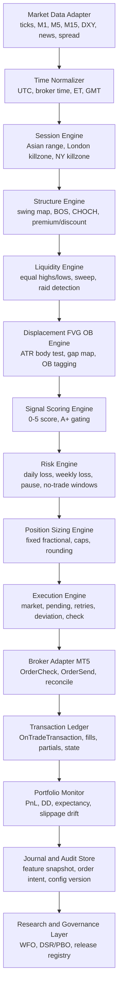
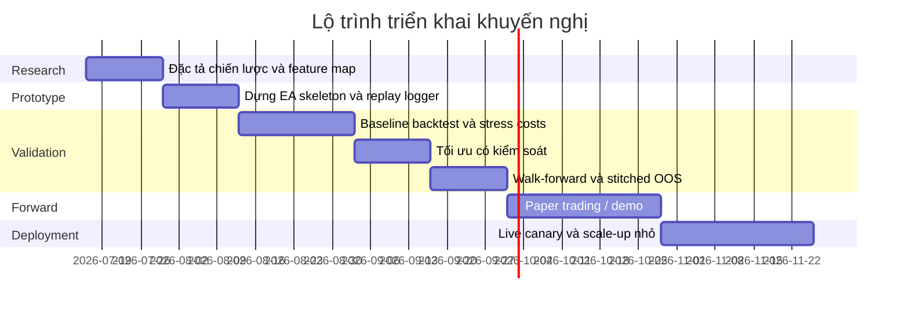
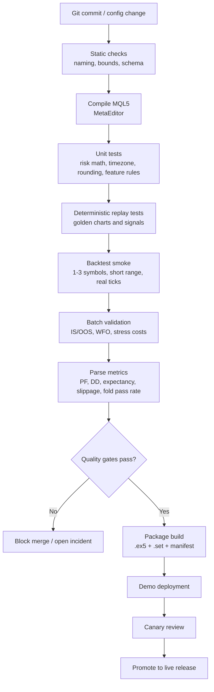

# Thiết kế khung xương EA định lượng từ báo cáo KLR-Scalper

## Tóm tắt điều hành

Bản báo cáo anh đã tải lên mô tả một chiến lược scalping theo mô hình “Killzone Liquidity Raid” với trọng tâm XAUUSD, phụ trợ EURUSD và GBPUSD, dùng M15 để xác định structure và bias, M5/M1 để vào lệnh, kết hợp liquidity raid, displacement, FVG/OB, daily bias và bộ lọc DXY cho vàng. Báo cáo cũng đã nêu rõ risk/trade, khung killzone, điều kiện vào/ra lệnh, giới hạn số lệnh theo ngày và kế hoạch backtest/walk-forward sơ bộ. fileciteturn0file0L7-L19 fileciteturn0file0L53-L75 fileciteturn0file0L117-L137

Đánh giá theo góc nhìn quant, đây là một **research memo / trader playbook tốt**, nhưng chưa phải là một “research paper” theo chuẩn tái lập đầy đủ. Điểm mạnh là chiến lược đã có tư duy asset-specific, risk-first và đã tự nhận diện được các rủi ro thực chiến như spread/slippage của Gold, crowding, edge decay và overfit theo regime. Điểm yếu là nhiều khái niệm quan trọng vẫn còn bán-chủ quan, đặc biệt quanh FVG/OB, quality của displacement, định nghĩa “messy structure”, nguồn dữ liệu DXY/news, và quan trọng hơn là phần nguồn tham chiếu của báo cáo vẫn gồm Reddit/blog/community thay vì data venue/broker/academic dataset có thể audit được. fileciteturn0file0L30-L39 fileciteturn0file0L81-L94 fileciteturn0file0L102-L116 fileciteturn0file0L152-L155

Vì báo cáo gốc đã nhắc thẳng tới manual forward test trên MT5 và “skeleton MQL5”, lựa chọn mặc định hợp lý cho production là **MT5/MQL5 cho execution**, kèm một **research harness ngoài EA** bằng Python hoặc notebook để làm nghiên cứu, replay, thống kê DSR/PBO và quản trị thí nghiệm. Đây là giả định triển khai vì yêu cầu của anh chưa khóa ngôn ngữ, broker hay môi trường cụ thể. MetaTrader 5 hỗ trợ Strategy Tester đa luồng, đa tài sản, real ticks, delay simulation và forward split; MQL5 cũng cung cấp các event cốt lõi như `OnTick`, `OnTradeTransaction` và `OnTester` để tách logic tín hiệu, hòa giải khớp lệnh và custom objective. fileciteturn0file0L131-L132 citeturn7view0turn5view0turn5view1turn5view2

Khung EA em đề xuất không nên bắt đầu như một “auto-money printer”, mà như một **state machine định lượng hóa dần**: trước hết biến toàn bộ khái niệm discretionary thành feature và rule có test được; sau đó mới nối execution, rồi mới tối ưu. Lý do là literature về backtest overfitting cho thấy chỉ riêng việc thử nhiều cấu hình tham số cũng có thể tạo ra hiệu năng ảo; vì vậy, một EA chuyên nghiệp cần bổ sung thêm Probability of Backtest Overfitting, Deflated Sharpe Ratio, multi-fold walk-forward và paper/live-forward trước khi có quyền cầm vốn thật. citeturn11view0turn11view1turn9view0turn9view1

Kết luận điều hành: **giữ chiến lược, nhưng đổi cách phát triển**. Không mã hóa trực tiếp “ICT idea” thành EA; thay vào đó, mã hóa nó thành: hệ feature khách quan, state machine vào lệnh, risk engine cứng, execution guardrails, kiểm thử có friction thật, và governance chặt đến mức một quant desk có thể audit được. Báo cáo gốc đã đi đúng hướng ở phần risk-first và asset-specific; phần còn thiếu là độ chặt của engineering, validation và kiểm soát drift. fileciteturn0file0L117-L137 citeturn7view0turn8view6turn11view0turn11view1

## Phản biện báo cáo nghiên cứu nguồn

Điểm đáng giữ lại nhất của KLR-Scalper là báo cáo **không cố biến một setup thành “universal logic”**. Nó nhấn mạnh Gold phải có stop rộng hơn, RR khác, max hold khác, filter khác và size khác so với majors; đồng thời cũng chặn hành vi nguy hiểm như averaging, revenge, overnight và weekend hold. Về tư duy trading, đây là dấu hiệu trưởng thành: edge không đến từ “một pattern giống nhau khắp nơi”, mà từ việc khớp pattern với microstructure của từng asset. fileciteturn0file0L21-L39 fileciteturn0file0L73-L75 fileciteturn0file0L126-L129

Bộ rule vào lệnh cũng đã có khung xương tương đối rõ: daily bias phải được resolve trước, chỉ giao dịch trong killzone xác định, sweep phải đi kèm displacement và MSS/BOS, entry trên retrace vào FVG/OB ở vùng premium/discount, có filter spread, news, ATR, Asian range, giới hạn số lệnh/ngày và có hard stop/time stop. Nếu phải nhận xét công bằng, phần này đã đủ tốt để chuyển thành **EA dạng semi-mechanical** ngay từ đầu. fileciteturn0file0L53-L75

Nhưng để thành **EA fully systematic**, ba lỗ hổng lớn cần được xử lý trước. Thứ nhất, báo cáo tự thừa nhận FVG đang “hơi chủ quan” và cần lượng hóa bằng body%ATR; đó là lời thú tội rất quan trọng, vì nếu không khóa được định nghĩa FVG/OB/displacement, EA sẽ chỉ là bản sao cơ khí của thiên kiến người viết. Thứ hai, chính báo cáo cũng nêu rằng “pro thường skip 30% setup dù match rule”, tức là con người vẫn đang dùng một lớp filter ẩn chưa được mô tả. Thứ ba, phần nguồn tham khảo cuối báo cáo gồm Reddit/blog/community resource, nghĩa là luận điểm về edge 2026 chưa đứng trên nền dữ liệu kiểm chứng độc lập. fileciteturn0file0L104-L105 fileciteturn0file0L92-L93 fileciteturn0file0L106-L110 fileciteturn0file0L152-L155

Về mặt kiểm định, báo cáo đã đi xa hơn nhiều tài liệu trader retail thông thường khi đề xuất IS/OOS 2019–2026, cost realistic, walk-forward 6 tháng tối ưu/3 tháng test và Monte Carlo 1000 lần. Đây là nền rất tốt. Tuy vậy, under a quant standard, em vẫn coi đây là **validation plan mới ở mức khởi thảo** vì chưa có experiment registry, chưa khóa rõ “bao nhiêu trial là một family”, chưa có DSR/PBO, chưa có policy xử lý multiple comparisons, và chưa có protocol tách riêng research change với execution change. Đó chính là lý do literature về PBO và DSR đáng được đưa vào ngay từ đầu. fileciteturn0file0L117-L125 citeturn11view0turn11view1

Cách đúng để “review và convert” báo cáo này không phải là hỏi “chiến lược có ngon không”, mà là hỏi: **nguyên khối logic nào có thể tái lập bằng dữ liệu, nguyên khối nào chỉ là ngôn ngữ trader**. Bảng dưới đây là bước dịch quan trọng nhất.

| Khái niệm trong báo cáo | Vấn đề khi đưa vào EA | Cách lượng hóa nên dùng |
|---|---|---|
| Daily Bias | Dễ bị đọc chủ quan nếu dùng HH/HL bằng mắt | Xác định bằng cấu trúc swing fractal cố định, hoặc CHOCH/BOS dựa trên pivot length đã khóa |
| Liquidity Raid / Judas | “Sweep” có thể quá rộng hoặc quá nhỏ | Wick vượt session high/low hoặc equal highs/lows tối thiểu `x` point và đóng lại trong range trong `n` bar |
| Displacement | “Mạnh” là khái niệm mơ hồ | `body_size >= k * ATR`, close nằm trong top/bottom `p%` của range bar, kèm BOS/CHOCH |
| FVG | Chủ quan nhất | Khoảng trống 3 nến với độ rộng tối thiểu `min_gap_points` hoặc `min_gap * ATR`; fill % đo được |
| Order Block | Dễ bị over-label | Nến đối ứng cuối trước displacement, thỏa điều kiện body/wick/volume proxy |
| Premium / Discount | Không khó nhưng dễ sai anchor | Neo theo dealing range đã khóa: session range, Asian range, hoặc swing range rõ ràng |
| DXY filter | Thiếu feed nếu broker không có symbol tương ứng | Mirror/inverse return của DXY hoặc proxy USD index; nếu thiếu dữ liệu thì disable chiến lược Gold |
| “A+ setup” | Chỉ là ngôn ngữ trader nếu không chấm điểm | Chuyển thành score 0–5, chỉ kích hoạt khi `score >= threshold` |
| Messy structure | Human veto ẩn | Gắn thành rule no-trade: overlap ratio cao, slope thấp, ATR thấp, bar compression kéo dài |

Bảng này không lấy đi “linh hồn” của chiến lược; ngược lại, nó ép chiến lược phải lộ ra **nguồn edge thật**. Nếu sau khi lượng hóa mà edge biến mất, điều đó thường có nghĩa edge trước đó nằm trong discretionary reading, không nằm trong rule. Đó là phát hiện có giá trị, không phải thất bại. fileciteturn0file0L84-L87 fileciteturn0file0L104-L105 citeturn11view0turn11view1

## Khung đặc tả EA định lượng

Bản thiết kế dưới đây đi theo một nguyên tắc rất “quant desk”: **research logic, execution logic, risk logic và governance phải tách lớp**. Báo cáo gốc đã mặc định MT5/MQL5 cho lộ trình ban đầu, nên em lấy môi trường đó làm mặc định triển khai; đồng thời, vì Strategy Tester có multi-currency, optimization, forward split và `OnTester`, nên nó phù hợp để làm execution engine/backtest runner, còn phần nghiên cứu thống kê sâu nên đặt bên ngoài EA. fileciteturn0file0L131-L132 citeturn7view0turn7view1turn25view3turn25view4

### Giả định và ràng buộc

| Hạng mục | Trạng thái | Giả định mặc định của em |
|---|---|---|
| Nền tảng production | **Chưa chỉ định** | MT5 + MQL5 |
| Nền tảng research | **Chưa chỉ định** | Python notebook / batch runner ngoài EA |
| Thị trường mục tiêu | **Chưa chỉ định** | XAUUSD là chính; EURUSD, GBPUSD là phụ theo báo cáo |
| Loại broker | **Chưa chỉ định** | ECN/raw-spread hoặc prop-compatible |
| Chế độ tài khoản | **Chưa chỉ định** | Hỗ trợ hedging; nếu netting thì phải sửa logic position state |
| Timezone chuẩn | **Chưa chỉ định** | UTC nội bộ; map ra ET/GMT/broker server time |
| Dữ liệu DXY/news | **Chưa chỉ định** | Có feed nội bộ hoặc proxy; nếu không có thì Gold filter phải disable hoặc no-trade |
| Khối lượng giao dịch | **Chưa chỉ định** | Fixed fractional, làm tròn theo `SYMBOL_VOLUME_STEP` |
| Kiểu execution | **Chưa chỉ định** | Market on confirmation là baseline; pending retrace là biến thể thứ hai |

Các ràng buộc broker không nên hard-code. MQL5 cho phép đọc trực tiếp `SYMBOL_TRADE_STOPS_LEVEL`, `SYMBOL_FILLING_MODE`, `SYMBOL_VOLUME_MIN/MAX/STEP/LIMIT`, execution mode và spread của từng symbol; vì vậy EA chuyên nghiệp phải introspect runtime symbol properties trước khi cho phép gửi lệnh. citeturn28view0turn27view5turn27view6turn27view4

### Các chiều thiết kế bắt buộc phải nghĩ như một quant

| Chiều thiết kế | Câu hỏi lượng hóa phải trả lời | Cách mã hóa trong EA |
|---|---|---|
| Strategy logic | Setup có tồn tại ở cấp dữ liệu hay chỉ tồn tại trên chart bằng mắt? | Feature extraction + signal score + state machine |
| Entry rules | Entry được kích hoạt bởi bar close, tick, hay pending touch? | Baseline: close-confirmed signal trên bar hoàn chỉnh; execution riêng |
| Exit rules | TP/SL/time-stop/BE/partial có deterministic không? | Exit policy module độc lập |
| Risk management | Loss cap theo trade/ngày/tuần/tháng là bao nhiêu? | Hard guard + kill switch |
| Position sizing | Lot tính theo risk %, ATR, equity hay fixed? | Sizing engine đọc symbol properties |
| Money management | Có compounding không? Có giảm size khi drawdown không? | Risk regime state |
| Slippage/latency | Fill mô phỏng ra sao? Lệch bao nhiêu so với expected? | Friction model + live reconciliation |
| Data requirements | Cần bars, ticks, DXY, calendar, spread history gì? | Data adapter + quality checks |
| Timeframe | M15 structure, M5 execution hay M1 refine? | Multi-timeframe cache tách lớp |
| Instrument universe | Có dùng một logic cho mọi asset không? | Không; parameter pack theo asset |
| Parameterization | Bao nhiêu tham số là “thật sự tự do”? | Parameter registry + bounds + families |
| Optimization control | Tối ưu cái gì và cái gì bị cấm tối ưu? | Freeze structural rules, chỉ tune threshold hợp lý |
| Walk-forward | Bao lâu IS, bao lâu OOS, tần suất refresh? | Rolling window batch |
| Live-forward | Demo/paper/life-size ladder thế nào? | Deployment ladder |
| Monitoring | Theo dõi expectancy, DD, slippage, uptime, drift gì? | Metrics store + alert policy |
| Logging | Audit được từ feature đến fill không? | Structured event log |
| Governance | Ai đổi rule, khi nào rollback, release nào đang live? | Versioned config + change control |

Điểm quan trọng nhất nằm ở chỗ **không tối ưu cấu trúc chiến lược và execution cùng lúc**. Nếu vừa đổi định nghĩa FVG vừa đổi SL buffer vừa đổi session gate, anh sẽ không biết edge đến từ đâu. Literature về PBO/DSR nói rất rõ: càng nhiều trial, khả năng “đào” được hiệu năng ảo càng cao. citeturn11view0turn11view1

### So sánh các phương pháp position sizing

Báo cáo gốc đang nghiêng về fixed fractional và giới hạn daily/overall loss rất chặt. Với một chiến lược intraday/prop-style như KLR, đây vẫn là điểm xuất phát tốt nhất. fileciteturn0file0L73-L75 fileciteturn0file0L126-L129

| Phương pháp | Ưu điểm | Nhược điểm | Khi nên dùng | Khuyến nghị cho KLR |
|---|---|---|---|---|
| Fixed lot | Rất đơn giản, dễ kiểm thử | Risk % thay đổi theo SL | Chỉ dùng để smoke test | Không nên dùng production |
| Fixed fractional | Ổn định, tỷ lệ hóa theo vốn, phù hợp prop | Có thể co size mạnh sau drawdown | Intraday discretionary/systematic cơ bản | **Khuyến nghị mặc định** |
| Volatility targeting | Chuẩn hóa risk theo regime | Dễ thêm layer complexity | Portfolio nhiều asset hoặc regime-sensitive | Dùng sau khi baseline ổn |
| Kelly/full Kelly | Tối đa hóa tăng trưởng lý thuyết | Quá nhạy với estimation error | Gần như không phù hợp live retail/prop | Không dùng |
| Fractional Kelly | Thực dụng hơn Kelly | Vẫn phụ thuộc ước lượng edge | Khi edge đã đo rất kỹ | Có thể cân nhắc ở giai đoạn muộn |
| Drawdown-adaptive sizing | Bảo vệ tài khoản tốt | Có thể “under-trade” khi edge quay lại | Live production có circuit breaker | **Nên thêm** dưới dạng cap giảm rủi ro |

Công thức baseline nên là: `lot = floor_to_step( account_risk_cash / stop_cash_value )`, trong đó bước làm tròn phải tôn trọng `SYMBOL_VOLUME_STEP`, còn volume tổng và khoảng cách stop phải tôn trọng `SYMBOL_VOLUME_LIMIT` và `SYMBOL_TRADE_STOPS_LEVEL`. fileciteturn0file0L127-L128 citeturn27view5turn28view0

### So sánh các kỹ thuật tối ưu hóa

MetaTrader 5 hỗ trợ full search và genetic optimization; QuantConnect tài liệu hóa rất rõ trade-off của walk-forward optimization và tần suất re-optimization. Với một chiến lược như KLR, mục tiêu không phải tìm “đỉnh lợi nhuận”, mà là tìm **vùng ổn định**. citeturn8view5turn8view6turn9view0turn9view1

| Kỹ thuật | Mạnh ở đâu | Rủi ro lớn nhất | Dùng cho KLR ra sao |
|---|---|---|---|
| Full grid / slow complete | Minh bạch, dễ audit | Nổ số tổ hợp, tốn compute | Dùng cho ít tham số quan trọng |
| Genetic algorithm | Nhanh trên không gian lớn | Dễ “nhảy” vào optimum mong manh | Chỉ dùng sau khi khóa family tham số |
| Random search | Bao phủ rộng, đơn giản | Không đẹp bằng grid về tính giải thích | Dùng ngoài MT5 nếu research bằng Python |
| Bayesian optimization | Hiệu quả compute | Dễ tối ưu quá mức objective duy nhất | Chỉ dùng khi đã có objective robust |
| Walk-forward optimization | Gần thực chiến hơn | Dễ lạm dụng re-opt quá thường xuyên | **Bắt buộc dùng** |
| CPCV / CSCV / PBO | Đo overfitting tốt | Phức tạp hơn WFO cổ điển | **Nên làm ngoài EA** |
| DSR screening | Giảm ảo giác nhiều trial | Cần log toàn bộ trial family | **Nên dùng như gate cuối** |

Khuyến nghị thực chiến là: **khóa cấu trúc**, chỉ tối ưu các threshold liên tục vừa phải, chạy WFO, sau đó dùng PBO/DSR để chặn false discovery. Đừng dùng genetic optimizer để “tìm chiến lược”; hãy dùng nó để **kiểm tra độ phẳng của vùng tham số**. citeturn11view0turn11view1turn8view5turn8view6

### Mô-đun và kiến trúc đề xuất

Các mô-đun nên được chia như sau:

| Mô-đun | Trách nhiệm chính | Ghi chú triển khai |
|---|---|---|
| Market Data Adapter | Lấy tick/bar đa khung, DXY, news, spread | Dữ liệu thiếu phải fail-safe, không im lặng |
| Time Normalizer | Đồng bộ ET/GMT/broker time | Bắt buộc vì báo cáo dùng lẫn ET và GMT |
| Session Engine | Đánh dấu Asian/London/NY killzone | Output phải deterministic theo timestamp |
| Structure Engine | Tạo swing map, BOS/CHOCH, bias | Không dùng visual judgement |
| Liquidity Engine | Equal highs/lows, session H/L, sweep | Lưu cả raw level lẫn trạng thái đã quét |
| Displacement-FVG-OB | Xác định bar impulse và retrace zones | Đây là lõi cần lượng hóa kỹ nhất |
| Signal Engine | Tính score và reason codes | Cho phép explain từng lệnh |
| Risk Engine | Hard cap, pause rules, kill switch | Chạy trước execution |
| Sizing Engine | Tính lot, làm tròn theo broker | Không hard-code lot step |
| Execution Engine | Chọn market/pending, deviation, retry | Tách khỏi generation logic |
| Reconciliation Engine | Hòa giải fills/partials/modifies | Dựa trên transaction events |
| Monitoring & Journal | Log chi tiết, metrics, alert | Phải đủ để replay hậu kiểm |
| Governance Layer | Version config, freeze window, release tag | Một production rulebook nhỏ |

Ở cấp event loop, EA nên đi theo cấu trúc này: `OnInit` nạp config và kiểm tra symbol capabilities; `OnTick` chỉ làm việc nhẹ và quản lý position/state; logic signal nặng chỉ chạy khi có **new completed bar**; `OnTradeTransaction` là sổ cái thực thi; `OnTimer` dùng để flush log, heartbeat và health checks; `OnTester` xuất custom objective khi backtest. MQL5 tài liệu hóa rõ rằng `OnTick` chỉ dành cho EA, `NewTick` không xếp thêm vào queue nếu một `NewTick` đang chờ hoặc đang xử lý, còn `OnTradeTransaction` có thứ tự đến không bảo đảm và queue dài 1024 phần tử. Vì vậy, mọi xử lý nặng trong `OnTick` đều là anti-pattern. citeturn5view0turn8view3turn8view0

## Lộ trình phát triển và xác thực

Báo cáo gốc đã gợi ý manual forward test, backtest đầy đủ, rồi small-live/challenge nhỏ; em giữ tinh thần đó nhưng nâng thành một **stage-gated development lifecycle**. Điểm khác biệt quan trọng là mỗi stage phải có deliverable rõ, KPI rõ và contingency rõ. Đồng thời, vì MT5 có thể forward split trực tiếp trong tester và QuantConnect mô tả rất rõ trade-off về tần suất walk-forward re-optimization, nên em xem WFO là bắt buộc, không phải “nếu có thời gian”. fileciteturn0file0L130-L137 citeturn8view6turn9view0turn9view1

| Giai đoạn | Deliverables | Quy trình từng bước | KPI / Gate | Datasets kiểm thử | Pitfalls thường gặp | Contingency |
|---|---|---|---|---|---|---|
| Research | Strategy spec v1, ambiguity log, feature dictionary, experiment registry | Đọc lại báo cáo; khóa định nghĩa bias/sweep/displacement/FVG/OB; tách biến cấu trúc với biến threshold; định nghĩa no-trade states; chốt objective family | 100% rule có định nghĩa dữ liệu; số “human-only” rule = 0 hoặc được đánh dấu semi-auto | Bars M1/M5/M15, tick, spread, DXY/proxy, economic calendar, broker symbol metadata | Nhầm giữa chart idea và measurable event; thiếu timestamp chuẩn | Nếu không lượng hóa được 1 khái niệm lõi, chuyển chiến lược sang semi-auto signal tool thay vì auto EA |
| Prototyping | EA skeleton, feature logger, chart debug overlay, replay harness | Dựng module; cài state machine; log full feature snapshot; chạy visual replay để kiểm từng trigger | Không duplicate order; không read future bar; 100% signal giải thích được bằng reason codes | 3–6 tháng dữ liệu tick của 1 asset | Xử lý quá nặng trong `OnTick`; lệch timezone; netting/hedging mismatch | Nếu logic chưa ổn định, giữ execution bằng market-only, bỏ pending orders tạm thời |
| Backtest | Baseline backtest pack, cost model, per-asset report | Chạy “every tick based on real ticks” làm baseline; thêm delay simulation; backtest từng asset riêng; chạy regime slices | OOS PF dương; expectancy dương; DD nằm trong budget; kết quả không sụp khi tăng friction | 2019–2026 theo báo cáo; regime buckets riêng | Dùng OHLC/open-price cho chiến lược intraday; quên 100 bars warm-up; pending-order latency bị mô phỏng thiếu | Nếu stress test với friction làm hỏng edge, giảm tần suất giao dịch hoặc bỏ asset đó |
| Optimization | Parameter stability map, plateau analysis, trial ledger | Chỉ tune threshold đã cho phép; chạy grid/genetic có bounds hẹp; ghi lại toàn bộ trials; so back vs forward | Không chọn optimum đơn lẻ; vùng tham số phải phẳng tương đối; DSR/PBO đạt ngưỡng nội bộ | Same IS window + full trial archive | Curve fit quá nhiều tham số; tối ưu cùng lúc structure và risk | Freeze structural rules, chỉ giữ 3–5 tham số nhạy nhất |
| Walk-forward | Fold reports, stitched OOS curve, stability dashboard | Chạy rolling IS/OOS; theo dõi tham số drift; đánh giá consistency theo fold và theo regime | Đa số folds pass; không có catastrophic fold; stitched OOS còn dương sau cost | IS/OOS rolling windows; thêm purge gap nếu dùng feature có horizon overlap | Re-opt quá dày; lấy WFO để “đào” thêm trial | Giảm tần suất re-opt, tăng window, hoặc quay về parameter pack cố định |
| Paper trading | Demo/paper journal, fill reconciliation, latency/slippage drift report | Chạy demo 4–8 tuần; so sánh signal-intent với actual fill; log missed-trade, rejected-trade, slippage delta | Uptime cao; reject rate thấp; actual slippage không lệch quá xa model; no governance breach | Live demo feed và broker thật dự kiến dùng | Broker-specific freeze level, fill mode, spread widening, DXY feed mismatch | Nếu broker variance lớn, đổi broker trước khi đổi strategy |
| Live deployment | Release bundle, rollback plan, runbook, kill-switch policy | Canary bằng size nhỏ; tăng size sau mốc trades/thời gian; lock config; weekly review; monthly model-risk review | Live expectancy không lệch quá xa paper; DD nằm trong budget; kill-switch chưa kích hoạt | Real live data + transaction logs | Thay đổi config giữa chừng; overreact sau vài lệnh; thiếu audit trail | Nếu drift kéo dài, rollback release; nếu edge decay rõ, retirement strategy |

Một điểm quant rất quan trọng là **ngưỡng thành công của từng stage không nhất thiết giống ngưỡng mục tiêu cuối cùng của báo cáo**. Báo cáo kỳ vọng PF > 1.45, Exp > 0.35R, MaxDD < 7%; em xem các số đó là mục tiêu aspirational sau tinh chỉnh, chứ không phải cơ sở chọn model. Trước khi đi tới đó, anh cần bằng chứng strategy không chỉ thắng vì trial mining. fileciteturn0file0L123-L125 citeturn11view0turn11view1

Cách chạy timeline trên nghe chậm, nhưng thực ra lại nhanh hơn về tổng thể. EA chết vì triển khai vội thường không chết ở “ý tưởng tín hiệu”, mà chết ở execution mismatch, broker constraints, governance drift và overfit. Chính báo cáo gốc cũng đã cảnh báo broker variance trên Gold, pause sau loss cluster và monthly review expectancy. fileciteturn0file0L88-L94 fileciteturn0file0L134-L137

## Dữ liệu, CI và vận hành sản xuất

MT5 cho phép test với “every tick based on real ticks”, có forward testing split, có delay simulation và có testing report với PF, Recovery Factor, Expected Payoff, Sharpe, MFE/MAE-related metrics; nhưng cũng có các caveat quan trọng: tester sẽ tự tải thêm dữ liệu lịch sử trước khoảng test để tạo tối thiểu 100 bars; network delay trong tester chỉ áp cho thao tác do EA gửi, còn execution của pending order về bản chất diễn ra phía server nên không bị network delay theo cùng cách; và Sharpe trong tester giả định risk-free rate bằng 0. Những chi tiết này có tác động rất lớn đến kết quả đối với một strategy retrace intraday như KLR. citeturn7view0turn8view6turn25view0turn25view1turn25view2

Mặt khác, `OrderSend()` trả về `true` không đồng nghĩa lệnh đã khớp; nó chỉ cho biết request đã qua kiểm tra cơ bản và được hệ thống giao dịch chấp nhận để xử lý tiếp. MQL5 khuyến nghị dùng `OrderCheck()` trước khi gửi để kiểm margin/equity/funds, và dùng `OnTradeTransaction()` để hòa giải trạng thái thực thay vì tin vào kết quả trả về tức thời. Đây là chỗ rất nhiều EA retail làm sai. citeturn27view0turn27view2turn27view3turn8view3turn8view0

### Lược đồ dữ liệu đề xuất

| Thực thể | Khóa chính | Trường quan trọng | Nguồn | Mục đích |
|---|---|---|---|---|
| `instrument_config` | `symbol` | spread_max, sl_buffer, rr_min, hold_max, session_profile, dxy_proxy | Static config | Parameter pack theo asset |
| `broker_capability_snapshot` | `symbol + ts` | filling_mode, stops_level, freeze_level, volume_step, volume_limit | MT5 symbol properties | Chặn lệnh không hợp lệ |
| `bar_cache` | `symbol + timeframe + ts` | O/H/L/C, spread, tick_count, atr | Market data | Feature extraction |
| `session_state` | `symbol + session_date` | asian_high/low, london_range, ny_range, killzone flags | Derived | Ngữ cảnh session |
| `structure_state` | `symbol + ts` | bias, swing_high/low, BOS, CHOCH, dealing_range | Derived | Daily bias / structure map |
| `liquidity_event` | `event_id` | level_type, swept_level, wick_size, reentry_close, session_tag | Derived | Sweep/raid detection |
| `imbalance_zone` | `zone_id` | type(FVG/OB), upper, lower, created_ts, fill_pct, valid_until | Derived | Entry zone |
| `signal_event` | `signal_id` | score, reasons[], regime_flags, eligible, reject_code | Derived | Audit được tại sao vào/không vào |
| `order_intent` | `intent_id` | side, entry_type, sl, tp1, tp2, deviation, expiry | Strategy output | Truy dấu trước khi gửi lệnh |
| `execution_report` | `exec_id` | retcode, requested_price, fill_price, slippage_pts, latency_ms | Broker / transaction | Hòa giải thực thi |
| `position_snapshot` | `ticket + ts` | size, avg_price, MAE, MFE, unrealized, realized | Broker state | Quản lý position |
| `risk_snapshot` | `account + ts` | day_pnl, dd_day, dd_week, consecutive_losses, paused_until | Risk engine | Circuit breaker |
| `experiment_registry` | `run_id` | code_hash, config_hash, data_range, friction_model, objective | Research pipeline | Tái lập thí nghiệm |
| `audit_log` | `event_id` | module, severity, message, payload_json | All modules | Điều tra và compliance nội bộ |

Nếu có thêm research harness bên ngoài MT5, em khuyến nghị log mọi thứ về dạng parquet/csv chuẩn hóa để tính thêm DSR, PBO, bootstrap và thống kê drift ngoài EA; còn trong EA, giữ log gọn hơn nhưng đủ tái lập level đầy đủ của mỗi lệnh. `TesterStatistics()` và `OnTester()` đã đủ để trích native statistics tại cuối mỗi pass, nhưng không đủ cho governance hiện đại nếu anh không lưu kèm config hash và family id của trials. citeturn25view3turn25view4turn25view5

### Pipeline kiểm thử và CI

Vì MT5/MetaEditor/Strategy Tester thực tế thuận tiện nhất trên Windows, CI production nên dùng **self-hosted Windows runner**. Research/statistical CI có thể chạy riêng bằng Python trên Linux nếu muốn. Mấu chốt là phải nối được compile, replay, smoke backtest và batch WFO thành một đường ống duy nhất.

Một CI chuẩn cho EA kiểu này nên có các lớp test sau:

| Lớp test | Mục tiêu |
|---|---|
| Unit tests | Lot sizing, rounding theo volume step, stop-distance, killzone mapping, score calculation |
| Property tests | Không trade ngoài killzone, không nới risk sau drawdown, không vượt daily loss |
| Deterministic replay | Cùng input phải ra cùng signal/order intent |
| Regression tests | Release mới không phá vỡ hành vi đã khóa |
| Execution simulation | Kiểm retry, rejected order, partial close, BE move, time-stop |
| Backtest smoke | Xác nhận không crash trên data thật |
| Batch validation | OOS, WFO, friction sensitivity, regime splits |
| Release audit | Code hash, config hash, data range, release note, rollback manifest |

### Monitoring, logging và governance

Báo cáo gốc đã có mầm governance khá tốt: pause sau 3 loss liên tiếp, weekly loss cap, monthly PF review, dừng nếu metrics giảm 20%, và kill strategy nếu 100 trades demo PF < 1.3 hoặc 3 tháng live expectancy âm. Em giữ tinh thần này nhưng chuẩn hóa thành policy table dưới đây. fileciteturn0file0L126-L137

| Miền kiểm soát | Metric | Tần suất | Trigger | Hành động |
|---|---|---|---|---|
| Health | EA heartbeat, terminal connected, symbol feed active | 1 phút | Mất heartbeat hoặc feed | Alert + disable entry |
| Execution | reject rate, slippage delta, latency ms | Mỗi lệnh / hàng ngày | Reject tăng bất thường, slippage drift | Hạ size hoặc dừng asset |
| Strategy | expectancy, PF, win/loss cluster, average hold | Hàng tuần | Giảm vượt tolerance | Chuyển sang paper-only |
| Risk | day DD, week DD, consecutive losses | Real time | Chạm cap | Kill switch / pause |
| Model drift | score distribution, regime mix, session-wise PnL | Hàng tuần / tháng | Distribution shift mạnh | Review hypothesis |
| Governance | code hash, config hash, manual override count | Mỗi release | Drift không có ticket | Rollback + incident |

Governance rule quan trọng nhất là: **mỗi lần chỉ đổi một family thay đổi**. Ví dụ, nếu release này đổi FVG definition thì không được đồng thời đổi risk cap và execution mode. Không có discipline này thì live telemetry sẽ vô nghĩa. Về mặt tổ chức, release bundle tối thiểu phải gồm: file `.ex5`, file `.set`, manifest hash, mô tả data range kiểm định, objective dùng để chọn build, và rollback target. Đây là thứ biến một EA từ “script giao dịch” thành “hệ thống giao dịch”. citeturn11view0turn11view1turn25view4

## Bài học cộng đồng và khuyến nghị cuối cùng

Vì anh yêu cầu phần “community-sourced enhancements”, em xếp các bài học dưới đây theo **độ tin cậy**, ưu tiên những gì được tài liệu chính thức xác nhận hoặc được chính báo cáo gốc thừa nhận. Những điểm chỉ xuất phát từ môi trường forum/blog mà không có đối chiếu tài liệu chính thức thì em hạ mức ưu tiên, không lấy làm rule cứng.

| Mức ưu tiên | Bài học | Vì sao đáng tin | Cách biến thành rule |
|---|---|---|---|
| Rất cao | Giữ `OnTick` càng nhẹ càng tốt; tính feature nặng trên completed bar | MQL5 nêu rõ NewTick không xếp thêm nếu đang có tick chờ/xử lý | Dùng new-bar scheduler; `OnTick` chủ yếu quản lý state và risk |
| Rất cao | Không coi `OrderSend()==true` là fill thành công | Doc MQL5 ghi rõ request có thể chỉ mới được chấp nhận để xử lý | Reconcile bằng `OnTradeTransaction`; log requested vs actual fill |
| Rất cao | Tự đọc symbol constraints từ broker, không hard-code | MQL5 có volume step, filling mode, stops level, freeze level riêng theo symbol | Runtime capability check trước khi bật EA |
| Rất cao | Slippage model cho FX/CFD không được để ở mức “0” một cách ngây thơ | QuantConnect tài liệu hóa `NullSlippageModel` là mặc định và `VolumeShareSlippageModel` có thể trả zero slippage khi không có volume ở Forex/CFD/Crypto | Dùng fixed/pessimistic slippage baseline; live-forward để calibrate |
| Cao | Không dùng chung một parameter pack cho Gold và majors | Báo cáo gốc nhấn mạnh asset-specific logic nhiều lần | Tách cấu hình theo asset ngay từ schema |
| Cao | A+ only và low frequency quan trọng hơn tăng số lệnh | Báo cáo gốc nhiều lần khẳng định chỉ giữ chiến lược khi cực selective | Signal score threshold + max trades/session/day |
| Trung bình | Các claim kiểu “public ICT đã crowded” hoặc “pass rate X% trên Reddit” chỉ nên là giả thuyết | Báo cáo trích Reddit/blog/community source, không phải dataset audit được | Không hard-code thành tiêu chí phê duyệt model |
| Trung bình | “Pro skip 30% setup dù match rules” nghĩa là còn hidden filter | Báo cáo tự nêu điểm này | Hoặc lượng hóa hidden filter, hoặc giữ chiến lược ở mode semi-auto |
| Trung bình | Pending-order retrace systems thường bị tester làm đẹp hơn live nếu không mô hình hóa execution đúng | MT5 chỉ mô phỏng network delay cho thao tác do EA gửi; execution pending xảy ra server-side | Baseline dùng market-on-confirmation; pending order là variant riêng |

Báo cáo gốc cũng đã chạm đúng hai nỗi lo mà cộng đồng quant/trader lâu năm tranh luận nhiều nhất: **edge decay** và **broker/execution variance**. Với KLR, em không lo nhất chuyện “setup có đẹp không”; em lo nhất chuyện sau khi lượng hóa xong, strategy còn đủ edge sau spread/slippage/news/broker variance hay không. Bởi chính phần edge analysis của báo cáo đã thừa nhận môi trường 2025–2026 khó hơn vì HFT cao hơn, fakeout nhiều hơn và Gold nhạy news hơn. fileciteturn0file0L76-L87 fileciteturn0file0L88-L94

Kết luận cuối cùng của em là: **KLR-Scalper đáng để chuyển thành EA skeleton, nhưng chưa đáng để chuyển thẳng thành fully automated live strategy**. Dạng đúng của nó ở vòng đầu là một EA có cấu trúc chuyên nghiệp gồm signal engine, risk engine, execution engine, reconciliation engine và audit layer; còn chuyện live vốn thật chỉ nên đến sau khi chiến lược đi qua đủ 7 stage ở trên, với parameter packs tách theo asset, friction model bảo thủ, WFO rõ ràng, paper-forward đủ dài và governance đủ chặt để rollback bất cứ lúc nào. Báo cáo gốc đã có “linh hồn trader” đúng; việc còn lại là ép nó đi qua “kỷ luật quant” để xem phần nào là edge thật, phần nào là ảo giác backtest. fileciteturn0file0L115-L116 fileciteturn0file0L140-L149 citeturn11view0turn11view1turn7view0turn8view6