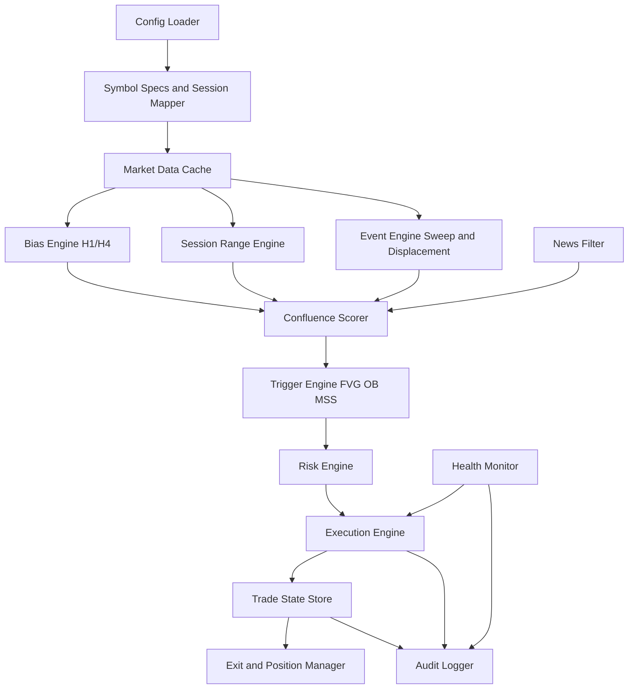
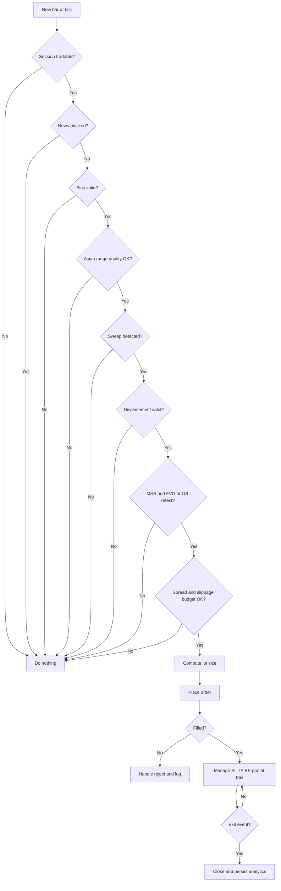

# Khung Chuyển Hóa Nghiên Cứu PO3-AMD Thành EA Có Thể Triển Khai

## Tóm tắt điều hành

Nghiên cứu gốc về **PO3-AMD Scalper** mô tả một mô hình scalping theo phiên với trọng tâm là **XAUUSD**, phụ trợ **EURUSD/GBPUSD**, dùng **H4/H1** cho bias, **M15** cho manipulation structure, và **M5/M1** cho entry trigger. Bộ khung này có ưu điểm lớn ở chỗ logic thị trường được tổ chức theo chuỗi hành vi rõ ràng — accumulation, sweep, displacement, distribution — kèm giới hạn rủi ro và tiêu chuẩn validation khá nghiêm; tuy nhiên báo cáo cũng tự thừa nhận nhiều điểm còn mang tính discretionary, đặc biệt ở bias, Asian range, MSS/CHOCH, và mức độ nhạy với spread/slippage trên Gold. Vì vậy, cách đúng để chuyển sang EA không phải là “chép rules thành code”, mà là **biến chiến lược thành state machine có predicate đo được**, rồi kiểm nó trong môi trường backtest có commission, spread, delay, OOS, walk-forward và Monte Carlo. fileciteturn0file0L41-L64 fileciteturn0file0L344-L350 fileciteturn0file0L412-L419

Ở góc nhìn quant, em khuyến nghị triển khai **EA bán cơ giới hóa hoặc full-auto có guard rails rất chặt** trên **MT5/MQL5** làm giả định mặc định, vì đây là nền tảng EA phù hợp nhất với yêu cầu “Expert Advisor”, có các event handlers riêng cho luồng giá, giao dịch và tối ưu hóa như `OnTick`, `OnTradeTransaction`, `OnTester`, đồng thời Strategy Tester hỗ trợ multi-currency, real ticks, forward testing, delay emulation và custom optimization criteria. Về mặt kỹ thuật, `OnTick` chỉ được phát cho symbol của chart gắn EA, trong khi tester vẫn có thể xử lý nhiều symbol mà EA sử dụng; điều này khiến kiến trúc **mỗi symbol một instance EA** là lựa chọn an toàn và sáng hơn cho phiên bản đầu tiên, thay vì cố viết multi-symbol router quá sớm. citeturn2view0turn3view0turn3view1turn7view0

Khuyến nghị triển khai mặc định là: **Phase 1 chỉ chạy XAUUSD và EURUSD**, **execution TF là M5**, **bias TF là H1/H4**, **BTC bị hoãn sang phase sau** vì chính nghiên cứu gốc cũng xem BTC là tertiary và còn tranh luận về độ nguy hiểm nếu thiếu funding/OI filter. Về go-live gate, nên giữ tiêu chuẩn khó: **PF sau cost tối thiểu 1.5**, **MaxDD không quá 5%**, **Expectancy tối thiểu 0.4R**, đồng thời phải sống được qua OOS, stress spread/slippage và walk-forward; nếu chưa đạt, EA chỉ nên dừng ở chế độ alert hoặc semi-auto. fileciteturn0file0L46-L50 fileciteturn0file0L440-L447 fileciteturn0file0L458-L460 fileciteturn0file0L490-L496

## Đánh giá nghiên cứu gốc và các giả định thiết kế

Nghiên cứu gốc mạnh ở ba điểm. Thứ nhất, nó đã **phân tách chiến lược theo asset** thay vì áp một rule-set duy nhất cho mọi thị trường; Gold, majors và BTC có buffer, holding time, spread allowance và extra filter khác nhau. Thứ hai, nó áp **killzone discipline** và giới hạn tần suất giao dịch — điều này rất hợp với tư duy prop-risk và giúp giảm overtrade. Thứ ba, nó đã có sẵn một validation skeleton gồm data 2022–2026, in-sample, out-of-sample, walk-forward, Monte Carlo và stress testing. Đây là nền tốt để lượng hóa. fileciteturn0file0L119-L149 fileciteturn0file0L151-L217 fileciteturn0file0L472-L496

Nhược điểm lớn nhất là **mức độ chủ quan còn sót lại**. Chính báo cáo ghi nhận Asian range đôi khi mơ hồ, bias Daily/H4 còn tính chủ quan ở định nghĩa HH/HL, và overfit có thể xảy ra nếu tối ưu quá sâu buffer/range size. Về mặt quant, đây là tín hiệu phải chuyển từ “pattern names” sang “state variables”: thay vì viết `if ICT_CHOCH` thì phải viết bằng swing definitions, body/ATR thresholds, time windows, buffer sizes, retest timeout, điều kiện invalidation và ranking logic rõ ràng. fileciteturn0file0L396-L399 fileciteturn0file0L412-L414 fileciteturn0file0L425-L430

Em dùng các giả định thiết kế sau để biến báo cáo thành EA framework cụ thể. **Ngôn ngữ lập trình mặc định: MQL5**. **Nền tảng mặc định: MT5**. **Universe mặc định phase đầu: XAUUSD, EURUSD**. **Execution timeframe mặc định: M5**. **Bias timeframe: H1/H4**. **Session engine dùng broker server time nhưng phải có lớp quy đổi sang ET/GMT** vì lịch kinh tế trong MQL5 dùng trade-server time chứ không dùng local time. **News filter ưu tiên MT5 Economic Calendar**, chỉ dùng external API khi broker feed thiếu dữ liệu. Các giả định này bám nghiên cứu gốc nhưng được ràng lại theo khả năng của nền tảng MT5/MQL5. fileciteturn0file0L46-L50 fileciteturn0file0L135-L149 citeturn13view0turn3view1

| Hạng mục | Nghiên cứu gốc nói gì | Vấn đề nếu code thẳng | Quyết định thiết kế EA |
|---|---|---|---|
| Bias | H4/Daily structure + premium/discount | Dễ discretionary | Dùng swing engine có lookback cố định, fractal/pivot rõ ràng, thêm rule “skip ngày sideway” |
| Asian range | Đánh dấu Asia high/low, có min size | Mơ hồ khi range bẩn hoặc quá hẹp | Tạo session box với min/max size, số lần wick xuyên range, và chất lượng range score |
| Sweep/Manipulation | Cần raid rồi displacement | Nếu không định lượng, backtest sẽ hindsight-biased | Sweep = vượt biên session tối thiểu `epsilon`; displacement = body hoặc close range expansion > `k * ATR` |
| Confirmation | MSS/CHOCH + FVG/OB + retest | Dễ overcomplicate | Bắt buộc 4 lớp: bias, session, sweep+displacement, retest trigger |
| Exit | BE sau 1R, partial ở 2R, trail phần còn lại | Dễ phát sinh branching khó kiểm soát | Chuẩn hóa thành state machine: `INIT -> ARMED -> BE -> SCALE_OUT -> TRAIL -> FLAT` |
| Risk | 0.25–0.4% challenge, daily stop 1.5–2%, weekly DD 3–4% | Nếu chỉ để trader tự nhớ sẽ fail live | Mã hóa thành hard guard, không phải guideline |

Bảng trên là phần “dịch chiến lược sang ngôn ngữ máy”, tổng hợp từ nghiên cứu gốc và các giới hạn nền tảng MT5/MQL5. fileciteturn0file0L224-L307 fileciteturn0file0L498-L521 citeturn2view0turn3view0turn13view0

## Đặc tả chiến lược để lượng hóa thành EA

### Tư duy lượng hóa tín hiệu

Mô hình nên được tổ chức như một **state machine năm lớp**: `Context -> Session -> Event -> Trigger -> Trade Management`. Context xác định môi trường cho phép giao dịch hay không. Session dựng Asian range và killzone. Event nhận diện sweep/displacement. Trigger tìm retest và xác nhận vào lệnh. Trade management xử lý SL/TP/BE/trailing và time stop. Đây là cấu trúc hợp lý hơn cách viết một hàm `CheckSignal()` dài và giúp kiểm thử từng lớp độc lập. Nghiên cứu gốc vốn đã xác định đầy đủ các khối này theo logic H4/H1, M15, M5/M1; việc của EA là biến chúng thành điều kiện có thể lặp lại. fileciteturn0file0L49-L54 fileciteturn0file0L234-L287 fileciteturn0file0L289-L307

### Đặc tả tín hiệu, entry, exit và filters

**Context/Bias Engine** nên dùng H1/H4 thay cho Daily làm lớp quyết định primary bias trong EA v1. Lý do là Daily cho scalping Gold thường quá chậm và tạo thêm chủ quan. Quy tắc khuyến nghị là: xác định pivot highs/lows trên H1/H4 bằng `swing_lookback`, tính chuỗi HH/HL hoặc LH/LL, sau đó kiểm tra giá hiện tại đang ở premium/discount so với dealing range tham chiếu. Nếu chuỗi structure không rõ, nếu biên H1 quá méo, hoặc nếu đang nằm quá gần midline mà không có HTF imbalance, EA **skip day** đúng theo tinh thần nghiên cứu gốc. fileciteturn0file0L225-L233 fileciteturn0file0L373-L374 fileciteturn0file0L425-L430

**Session Engine** tạo Asian range theo cửa sổ thời gian cấu hình. Vì lịch kinh tế MQL5 hoạt động theo trade-server time, session windows cũng phải convert cùng hệ quy chiếu; nếu không, killzone và news filter sẽ lệch nhau dù code nhìn có vẻ đúng. Range phải có `min_size` và `max_size`, đồng thời có thể thêm một quality score như: số lần chạm biên, độ nén ATR, số nến overlap, hoặc tỷ lệ thân/bóng trung bình trong range. Chỉ nhận range “tradable” khi đạt quality threshold; đây là cách giảm hindsight bias mà nghiên cứu gốc nêu ra quanh chuyện Asian range bị mơ hồ. fileciteturn0file0L234-L242 fileciteturn0file0L396-L399 citeturn13view0

**Manipulation/Event Engine** nên định nghĩa sweep là giá chọc qua Asian high/low ít nhất `sweep_epsilon` rồi có close đảo ngược hoặc tạo displacement theo hướng ngược lại trong `N` bar kế tiếp. Displacement không nên chỉ nhìn cảm tính; chính báo cáo debate đã gợi ý dùng tối thiểu khoảng `1.5x ATR` cho thân nến displacement. Với Gold, thêm điều kiện ATR M5 tối thiểu để tránh những cú quét yếu trong môi trường vol thấp. fileciteturn0file0L243-L252 fileciteturn0file0L398-L399 fileciteturn0file0L282-L283

**Trigger Engine** ở M5 là lựa chọn mặc định. Sau sweep và displacement, EA cần chờ một trong hai trigger: retest FVG hợp lệ hoặc retest OB hợp lệ. FVG nên được đo bằng mô hình 3 nến chuẩn; OB nên được ràng bằng “last opposing candle before displacement” như nghiên cứu gốc. Để tránh overtrading, entry chỉ kích hoạt khi đủ số điểm confluence tối thiểu, ví dụ `bias + sweep + displacement + MSS + retest`, trong đó cho phép thiếu tối đa một thành phần; đây là cách cơ giới hóa rule “4/5 confluence” trong nghiên cứu gốc. fileciteturn0file0L253-L275

**Exit Engine** cần cứng và tối giản. Stop-loss nên nằm ngoài manipulation extreme cộng buffer theo asset. Sau khi đạt **1R**, vị thế chuyển sang trạng thái bảo toàn vốn; sau **2R** thì đóng một phần, rồi trailing phần còn lại theo swing gần nhất hoặc ATR trail. Ngoài ra phải có **time stop**: nếu lệnh không đạt 1R trong khoảng thời gian nhất định thì đóng hoặc siết stop, và phải có **hard max hold** theo asset. Nghiên cứu gốc đã cung cấp đầy đủ logic này; EA chỉ cần chuẩn hóa, không nên sáng tạo thêm quá sớm. fileciteturn0file0L291-L307

### Khuyến nghị mặc định theo tài sản và khung thời gian

| Instrument | Vai trò | Bias TF | Trigger TF | Risk mặc định | Ghi chú triển khai |
|---|---|---|---|---|---|
| XAUUSD | Chính | H1/H4 | M5 | 0.25% challenge, 0.10–0.20% live | Ưu tiên London Judas + NY early; spread/slippage guard chặt |
| EURUSD | Phụ | H1/H4 | M5 hoặc M1 confirm phụ | 0.30% challenge, 0.15–0.20% live | Session clean hơn Gold, suitable cho phase đầu |
| GBPUSD | Phase sau | H1/H4 | M5 | 0.25–0.30% | Chỉ thêm sau khi XAUUSD/EURUSD ổn |
| BTCUSD | Hoãn | H1/H4 | M5 | 0.15–0.20% | Chỉ mở lại nếu có funding/OI filter ngoài |

Bảng mặc định này bám nghiên cứu gốc về asset priority, risk range, killzone usage và cảnh báo của hội đồng rằng BTC nên bỏ ở phase đầu. fileciteturn0file0L86-L117 fileciteturn0file0L151-L217 fileciteturn0file0L440-L447

### So sánh các lựa chọn thiết kế

| Quyết định | Lựa chọn an toàn | Lựa chọn nhanh hơn | Lựa chọn mạnh nhưng khó | Khuyến nghị |
|---|---|---|---|---|
| Kiến trúc symbol | Một EA cho một chart/symbol | Một EA multi-symbol | Router + shared execution service | **Một EA cho một symbol** ở v1 |
| Order type | Limit on retest | Market on confirmation close | Stop-limit hybrid | **Limit on retest** cho Gold, Market chỉ khi spread/slippage tốt |
| Stop placement | Structural extreme + buffer | ATR stop | Hybrid structural + ATR cap | **Hybrid** |
| Bias engine | Swing structure | MA/regime proxy | Structure + correlated filter | **Structure là lõi**, filter tương quan chỉ optional |
| News filter | MT5 Economic Calendar | External API | Kết hợp cả hai | **MT5 calendar trước**, API là fallback |

Bảng này phản ánh cả tính khả thi kỹ thuật lẫn rủi ro execution. `OnTick` chỉ phát cho symbol của chart, Economic Calendar dùng server time, và tester cho phép mô phỏng delay nên việc đơn giản hóa kiến trúc đầu tiên sẽ làm khâu kiểm thử và đối chiếu broker dễ hơn đáng kể. citeturn2view0turn13view0turn5view0

## Khung rủi ro và quản lý vốn

Nghiên cứu gốc đúng ở điểm cốt lõi: chiến lược này **không phù hợp** với tư duy “ăn bằng frequency” hay gồng margin. Nó chỉ có ý nghĩa khi risk được hard-code. Mức mặc định hợp lý là **0.25–0.35% mỗi lệnh** cho prop-style evaluation và **0.10–0.20%** cho live; dừng ngày ở **1.5%**, dừng tuần ở **3–4%**, và nếu tổng drawdown chạm vùng **6%** thì phải giảm risk một nửa hoặc dừng hệ thống. Những guard này không nên là input “để trader tự giác”, mà phải là circuit breaker trong EA. fileciteturn0file0L500-L521

Công thức position sizing nên dùng **fixed fractional theo stop-distance thực tế**, không dùng lot cố định. Công thức thực dụng là:

```text
risk_money = equity * risk_pct
effective_stop_cost = SL_points * point_value + expected_slippage_cost + commission_equiv
lots = floor_to_step(risk_money / effective_stop_cost)
```

Điểm quan trọng là `effective_stop_cost` phải cộng cả **slippage dự kiến** và **commission quy đổi**, nếu không Gold sẽ luôn backtest đẹp hơn live. Nghiên cứu gốc đã cảnh báo riêng về cost erosion trên XAUUSD, còn tài liệu giao dịch/optimization của MT5 cho phép mô phỏng commission, delay và cả điều kiện tài khoản/broker trong tester, nên phần này hoàn toàn có thể kiểm được định lượng. fileciteturn0file0L345-L346 citeturn5view0turn3view1turn19academia0

Về money management, em khuyến nghị **chỉ dùng fixed fractional ở phiên bản chính**. Volatility targeting có thể thêm ở phase sau bằng cách giảm `risk_pct` khi ATR regime quá cao, nhưng không nên dùng martingale, anti-martingale mạnh hay Kelly fraction. Với kiểu intraday prop-oriented, mục tiêu quan trọng hơn là **khả năng sống qua loss cluster** chứ không phải tối đa hóa growth rate lý thuyết. Báo cáo gốc cũng nhận diện nguy cơ cluster 4–5 lệnh thua và loss streak 8 lệnh như kịch bản xấu cần bảo vệ trước. fileciteturn0file0L381-L382 fileciteturn0file0L450-L460

Một lớp nữa cần có là **portfolio risk control**. Nếu chạy đồng thời XAUUSD và EURUSD, EA master hoặc risk layer ngoài cần chặn trạng thái exposure quá đồng pha, nhất là khi USD news sắp ra. Nghiên cứu gốc đã nêu không nên giao dịch hai pair có correlation cao cùng lúc; ở mức hiện thực hóa, điều này có thể đơn giản hóa thành rule: “mỗi thời điểm chỉ một lệnh active trên nhóm USD majors”, hoặc “nhóm correlated tickets chia chung daily risk budget”. fileciteturn0file0L514-L515

## Kiến trúc EA mô-đun và tham số hóa

Kiến trúc phù hợp nhất là **modular, event-driven, stateful**. `OnInit()` chịu trách nhiệm nạp config, tạo indicator handles, map broker time, kiểm tra symbol specs và warm-up data. `OnTick()` không nên làm mọi thứ; nó chỉ nên gọi scheduler nhẹ, cập nhật market snapshot, kích hoạt signal engine nếu bar mới hoặc event mới phát sinh. `OnTradeTransaction()` mới là nơi cập nhật trạng thái execution, fill, partial close, stop modifications và reconciliation — đặc biệt quan trọng vì MetaQuotes nói rõ **thứ tự trade transactions không được bảo đảm**, một request có thể sinh nhiều transaction, và queue có giới hạn 1024 phần tử, nên handler này phải rất nhẹ và không blocking. `OnTester()` dùng để trả về custom criterion cho optimization, thay vì chỉ bám một metric mặc định như profit hay Sharpe. citeturn2view0turn3view0turn7view0



Data inputs cho EA nên chia bốn lớp. **Market data** gồm tick, bar, ATR, session highs/lows. **Execution data** gồm spread, commission, freeze level, stop level, tick size/value, fill mode. **Context data** gồm lịch kinh tế và broker server time. **Research telemetry** gồm MAE/MFE per trade, realized slippage, rejected orders, skipped setups. Strategy Tester của MT5 có thể test nhiều symbols, cho sửa symbol settings và account parameters, đồng thời testing report xuất ra rất nhiều metric như drawdown, profit factor, recovery factor, expected payoff, Sharpe, Z-score, MAE/MFE correlation; vì vậy hãy tận dụng tester như một phòng lab, không chỉ như máy in equity curve. citeturn3view1turn21view0

**Logging** nên có hai tầng. Tầng một là log phát sinh tự động theo transaction và state transitions: `signal_id`, `symbol`, `session_id`, `bias_state`, `event_state`, `spread`, `sl_points`, `tp_plan`, `order_type`, `fill_price`, `slippage`, `exit_reason`. Tầng hai là research log dạng CSV/parquet để hồi cứu theo batch. Đây là phần cực kỳ quan trọng, vì khi live khác backtest, anh chỉ có thể chẩn đoán bằng telemetry, không phải bằng cảm giác. Tư duy này phù hợp với transaction cost analysis trong thực hành thuật toán: muốn biết underperformance đến từ đâu thì phải log bối cảnh thị trường, chất lượng execution và anomaly factors theo thời gian. citeturn19academia0turn3view0

### Cấu trúc tham số

Để tránh overfitting, parameter set phải được phân tầng:

| Nhóm tham số | Ví dụ | Có được optimize mạnh không | Ghi chú |
|---|---|---|---|
| Cấu trúc | swing lookback, premium/discount threshold, FVG min size | Không | Chỉ cho phép dải hẹp, vì chạm vào logic cốt lõi |
| Session | Asian window, killzone windows, min/max range | Có giới hạn | Cần khóa theo broker timezone map |
| Event | sweep epsilon, displacement ATR multiple, retest timeout | Có | Đây là nhóm quan trọng nhất để tune |
| Execution | order type, slippage tolerance, max spread | Có | Tối ưu theo broker group, không tối ưu toàn cục |
| Risk | risk_pct, daily stop, BE trigger, partial ratio | Rất hạn chế | Thuộc governance nhiều hơn alpha |
| Validation | IS/OOS windows, WFO step, stress multipliers | Không | Đặt trước khi nghiên cứu |

Nguyên tắc quant ở đây là **optimize “vùng ổn định”, không optimize điểm tối ưu độc nhất**. Các framework chống overfitting gần đây đều nhấn mạnh việc chọn vùng tham số bền vững, dùng majority-pass/catastrophic-veto, và tránh xem backtest tốt nhất là sự thật. `OnTester()` cho phép anh định nghĩa một custom score phù hợp hơn với prop/live reality, ví dụ phạt nặng drawdown, phạt trade count quá thấp, phạt OOS decay, thay vì lấy mỗi net profit. citeturn7view0turn17academia0turn0academia4



## Giao thức kiểm thử, tối ưu hóa và xác thực

Backtest cho chiến lược này phải được đối xử như **một thử nghiệm khoa học có hypothesis**, không phải một cuộc thi tìm ra đường equity đẹp nhất. Strategy Tester của MT5 hỗ trợ cả single test lẫn optimization, multi-threading, remote agents, forward period, delay emulation và nhiều tick generation modes. Tuy nhiên, built-in forward test của MT5 chỉ là lớp lọc đầu tiên; nó chia period thành backtest và forward, rồi chạy phần tốt nhất sang đoạn mới hơn. Cái đó hữu ích, nhưng chưa đủ để khẳng định robustness. Để giảm overfitting, quy trình đúng là: định nghĩa trước không gian tham số, chạy coarse search, chọn plateau, rồi kiểm lại bằng rolling walk-forward, strict OOS lock, stress execution và Monte Carlo. citeturn3view1turn4view1turn5view0turn17academia0turn0academia4

### Chuẩn dữ liệu và mô hình kiểm thử

Về data fidelity, **final validation phải dùng “Every tick based on real ticks”** hoặc ít nhất “Every tick”, không dùng OHLC để quyết định go-live. MT5 cũng cho phép mô phỏng network delay ngẫu nhiên hoặc cố định, thêm điều kiện tài khoản, commission, margin và custom symbol settings để gần với broker/prop environment thật hơn. Bên cạnh đó, testing report còn có **History Quality**, nên mọi nghiên cứu cần đặt ngưỡng chất lượng dữ liệu tối thiểu trước khi chấp nhận kết quả. citeturn4view3turn5view0turn21view0

Với riêng PO3-AMD, em đề xuất giữ đúng tinh thần nghiên cứu gốc nhưng ràng chặt hơn như sau: **IS = 2022-2024**, **OOS khóa cứng = 2025**, **shadow/live-like evaluation = 2026 YTD đến 15/07/2026**, đúng mốc báo cáo gốc dùng. Walk-forward nên dùng **rolling 6 tháng train / 3 tháng test** ở phase đầu; sau khi chọn vùng ổn định, làm thêm một pass **anchored WFO** để xem chiến lược có lợi từ thêm dữ liệu hay không. Monte Carlo tối thiểu **1,000 runs** với trade reshuffle, bootstrapped loss clusters và random slippage. fileciteturn0file0L474-L485

### Tối ưu hóa tham số theo cách của quant

Tiến trình tối ưu nên có ba vòng. **Vòng đầu**: tìm ngưỡng logic bằng slow complete search trên không gian nhỏ, chỉ vài biến thật sự quan trọng như `range_min`, `displacement_atr_mult`, `buffer_pts`, `retest_timeout`. **Vòng hai**: dùng genetic optimization trên dải đã thu hẹp để chạy nhanh hơn, nhưng chỉ như công cụ khám phá surface, không phải để “chọn winner”. **Vòng ba**: chốt một cụm tham số gần plateau rồi kiểm nghiêm bằng OOS/WFO/stress. MT5 hỗ trợ cả slow complete lẫn fast genetic optimization, và custom criterion thông qua `OnTester()`, nên có thể gói triết lý lựa chọn ngay trong engine nghiên cứu. citeturn6view0turn6view1turn7view0

Một custom criterion hợp lý cho chiến lược kiểu này không nên chỉ tối đa hóa lợi nhuận. Em đề xuất một hàm kiểu:

```text
Score = OOS_PF
        * sqrt(max(TotalTrades, 1))
        * max(Expectancy_R, 0)
        * exp(-lambda * MaxDD_pct)
        * exp(-mu * SlippagePenalty)
        * StabilityBonus
```

Trong đó `StabilityBonus` chỉ dương khi vùng tham số có surface đủ phẳng và có majority-pass qua các fold WFO. Ý tưởng này phù hợp với tinh thần của các framework chống overfit gần đây: ưu tiên **độ bền của tham số** và **khả năng sống qua regime/test windows**, không worship “best pass”. citeturn7view0turn17academia0turn23search0

### Các chỉ số bắt buộc phải báo cáo

| Nhóm | Metric | Vai trò | Ngưỡng gợi ý |
|---|---|---|---|
| Lợi nhuận | Total Net Profit, Expected Payoff, Expectancy theo R | Đo kết quả tuyệt đối và trung bình | Expectancy ≥ 0.4R |
| Rủi ro | Balance/Equity Max DD, Recovery Factor | Đo độ đựng lỗ thực sự | MaxDD ≤ 5% |
| Chất lượng lệnh | Profit Factor, Avg Win/Avg Loss, Win rate | Đo profile payoff | PF ≥ 1.5 sau cost |
| Ổn định | LR Correlation, LR Std Error, số tháng lời | Đo độ “mượt” của equity | LR Corr cao, suy giảm OOS chấp nhận được |
| Hành vi chuỗi lệnh | Max consecutive losses, Average consecutive losses, Z-score | Đo cluster risk | Không có streak vượt budget |
| Execution | Slippage distribution, reject rate, spread at entry | Đo khả năng sống live | P95 slippage nằm trong budget |
| Position quality | MFE/MAE correlation, holding time stats | Đo chất lượng SL/TP | MAE kiểm soát được, hold time phù hợp |
| Chống overfit | OOS/IS ratio, WFO pass ratio, DSR hoặc tối thiểu trial count log | Đo nguy cơ false discovery | Majority-pass, không có catastrophic veto |

Các metric built-in như drawdown, PF, Recovery Factor, Expected Payoff, Sharpe, Z-score, MFE/MAE correlation và holding time đã có sẵn trong MT5 testing report; còn OOS/IS ratio, slippage distribution, WFO pass ratio và DSR/PBO cần log ngoài tester. Đồng thời phải nhớ rằng Sharpe ratio có thể bị bóp méo khi returns có serial correlation hoặc khi chọn winner từ quá nhiều trials, nên Sharpe chỉ là một thành phần chứ không phải “quan tòa cuối cùng”. citeturn21view0turn11academia0turn11academia1turn23search0

## Triển khai thực chiến, giám sát và ứng phó sự cố

### Checklist triển khai

| Mục | Trạng thái cần đạt | Vì sao quan trọng |
|---|---|---|
| Version freeze | Mã nguồn, set file, build hash được khóa | Tránh “live khác backtest vì sửa lặt vặt” |
| Session map | Broker time ↔ ET/GMT ↔ news time được xác thực | Tránh lệch killzone/news filter |
| Symbol specs | Digits, point, tick value, stops/freeze level, fill mode đã kiểm | Tránh sai lot và sai stop |
| Cost model | Spread, commission, delay budget bám broker/prop thực tế | Tránh ảo tưởng expectancy |
| Risk guards | Daily/weekly/overall DD breakers bật cứng | Tránh fail vì một ngày xấu |
| Telemetry | Log file, deal analytics, alerts hoạt động | Tránh “không biết lỗi ở đâu” |
| Shadow run | Chạy demo/paper tối thiểu vài tuần | So sánh execution reality |
| Go-live | Chỉ sau khi OOS/WFO/stress pass | Tránh lấy backtest làm niềm tin |

Checklist này là phần nối giữa research và live. Rất nhiều hệ thống “chết” không phải vì logic vào lệnh sai, mà vì timezone, spec mismatch, commission hoặc order handling. MT5 cho phép mô phỏng account parameters, commissions và custom symbol settings, nên phần khác biệt broker/phòng prop hoàn toàn phải được kiểm trước khi live. citeturn3view1turn5view0

### Monitoring và alerting

Giám sát nên có ba tầng. **Tầng hệ thống**: heartbeat, build version, chart attached, data freshness, calendar availability. **Tầng giao dịch**: number of blocked setups, order rejects, spread spikes, slippage spikes, daily DD status. **Tầng alpha health**: rolling PF 20 lệnh, realized expectancy, per-session win rate, regime-bucket performance. Với MT5, `SendNotification()` có thể dùng để đẩy cảnh báo ra mobile, nhưng phải nhớ nó **không chạy trong Strategy Tester**, giới hạn **2 lần/giây** và **10 lần/phút**; vì thế đối với backtest và stress lab, tất cả cảnh báo phải log nội bộ trước, rồi mới bật push khi chạy demo/live. citeturn14view0

News filter nên ưu tiên Economic Calendar của MQL5, vì có thể truy vấn lịch sự kiện theo khoảng thời gian, country/currency; nhưng module này dùng **trade server time**, không phải local time. Do đó, alerting phải log đồng thời ba mốc giờ: server time, UTC và giờ anh dùng để review. Đây là chi tiết nhỏ nhưng có sức phá hệ thống rất lớn. citeturn13view0

### Kế hoạch ứng phó cho các sự cố thường gặp

| Sự cố | Dấu hiệu | Phản ứng tự động | Hành động nghiên cứu |
|---|---|---|---|
| Slippage tăng mạnh | Fill xấu hơn budget, P95 slippage nhảy vọt | Giảm order aggressiveness, ngừng market order, hạ risk hoặc block phiên | So sánh theo broker, thời điểm, session, loại lệnh |
| Dữ liệu lỗi / history kém | History Quality thấp, session box vô lý | Block optimization/go-live trên dataset đó | Thay nguồn data, rebuild dataset |
| Broker khác biệt | Cùng set file nhưng kết quả lệch mạnh | Dùng symbol-profile riêng cho từng broker group | Stress lại bằng custom symbol settings |
| Regime shift | Rolling PF giảm sâu, vol hoặc trend mode đổi | Kích hoạt kill-switch, giảm risk, chuyển alert-only | Refit nhẹ trên vùng tham số, không mở rộng search bừa |
| News filter lỗi | Trade đúng lúc high-impact release | Hard disable entries nếu calendar unavailable | Kiểm lại timezone map và fallback provider |
| Event queue nghẽn | Missed transaction updates, state sai | Giảm xử lý nặng trong `OnTradeTransaction`, tách logger async/light | Audit event ordering, tối giản execution path |
| Alert spam | Nhiều notification bị drop | Throttle cảnh báo | Gom alert theo severity, minute buckets |

Các nội dung trên không phải “optional engineering polish”; chúng là thứ phân biệt EA research toy với EA có thể sống. Đặc biệt, tài liệu MQL5 nói rõ transaction order không guaranteed và queue hữu hạn, còn MT5 tester cho phép mô phỏng delay/requote; nên execution-state handling phải được thiết kế như một rủi ro hạng một. citeturn3view0turn5view0turn14view0turn21view0

### Cải tiến cộng đồng và bẫy thường gặp

Phần cộng đồng trong nghiên cứu gốc cho thấy một số enhancement đáng cân nhắc sau khi core system đã ổn: thêm **orderflow/Bookmap** nếu có dữ liệu, chỉ giao dịch **một killzone/ngày**, chờ **1–2 candle confirmation** sau retest, **scale out sớm hơn trên Gold**, hoặc lai với **KLR** nhưng phải test riêng từng biến thể. Dưới góc nhìn triển khai, các enhancement này nên đứng sau một feature flag, không trộn thẳng vào core logic v1. fileciteturn0file0L376-L379 fileciteturn0file0L433-L439 fileciteturn0file0L542-L548

Còn các bẫy điển hình thì nghiên cứu gốc nêu rất đúng: **hindsight bias** khi đánh range/sweep sau khi đã thấy kết quả, **subjectivity** ở bias/structure, **cost erosion** trên Gold, **news sensitivity**, **overfit buffer/range size**, và **tham mở thêm BTC quá sớm**. Một bẫy nữa dưới góc nhìn quant là tối ưu hóa quá nhiều biến trên cùng một engine rồi chỉ lưu kết quả tốt nhất. Khi nhiều trials được chạy, Sharpe và equity đẹp rất dễ là sản phẩm của selection bias; đó là lý do phải log toàn bộ thử nghiệm, không chỉ lưu “winner”, và dùng OOS/WFO/DSR hoặc ít nhất record trial counts để tự bảo vệ mình khỏi backtest overfitting. fileciteturn0file0L344-L350 fileciteturn0file0L373-L379 fileciteturn0file0L450-L460 citeturn23search0turn0academia4turn17academia0

## Lộ trình phát triển và roadmap ưu tiên

Nghiên cứu gốc đã gợi ý tiến trình hợp lý: manual/demo trước, rồi backtest đầy đủ, rồi semi-auto, rồi live nhỏ. Em giữ tinh thần đó nhưng chi tiết hóa thành roadmap thực thi để tránh nhảy cóc từ ý tưởng sang full-auto. fileciteturn0file0L526-L548

### Timeline đề xuất

| Giai đoạn | Thời lượng gợi ý | Deliverable | Go/No-go |
|---|---:|---|---|
| Rule formalization | 1 tuần | Tài liệu logic đo được, session map, signal dictionary | Chưa code nếu rule còn mơ hồ |
| Prototype research harness | 1 tuần | Script/backtest harness đo session, sweep, displacement, FVG | Nếu event detection không ổn, dừng ở đây |
| EA skeleton | 1–2 tuần | Modules: config, data cache, signal engine, risk engine, execution, logger | Chưa tối ưu nếu logging chưa đủ |
| Historical validation | 2 tuần | IS/OOS, stress delay/spread, broker profiles | Nếu PF/DD không đạt, không sang demo |
| Walk-forward và Monte Carlo | 1 tuần | WFO pass map, drawdown distribution, slippage stress | Nếu có catastrophic veto, quay lại research |
| Shadow demo | 2–4 tuần | Alert/live execution comparison, slippage profile thực tế | Nếu live drift quá xa backtest, freeze |
| Small live / prop sim | 2 tuần đầu | Risk cực nhỏ, health dashboard, kill-switch active | Chỉ scale khi alpha-health ổn |

### Roadmap ưu tiên

| Ưu tiên | Hạng mục | Tác động | Phụ thuộc |
|---|---|---|---|
| P0 | Chuẩn hóa bias, range, sweep, displacement thành predicate | Cực cao | Không |
| P0 | Hard-code risk circuit breakers | Cực cao | Không |
| P0 | Logging theo state + transaction | Cực cao | Bộ khung EA |
| P1 | XAUUSD và EURUSD only | Cao | P0 |
| P1 | Backtest real ticks + delay + commission | Cao | P0 |
| P1 | Built-in + custom metrics + OOS/WFO dashboard | Cao | P0 |
| P2 | One-symbol-per-instance deployment | Trung bình nhưng an toàn | P1 |
| P2 | Push alerts và health monitor | Trung bình | P1 |
| P3 | Optional enhancements: DXY filter, killzone selector, orderflow flag | Có ích nhưng không cấp bách | P1/P2 |
| P3 | BTC module hoặc hybrid KLR | Thấp ở phase đầu | Core system ổn định |

Nếu cần chốt một đường đi ngắn gọn: **đừng code “mọi thứ chiến lược nghĩ ra”. Hãy code phần cứng nhất trước** — bias objectification, session box, sweep/displacement, risk guards, logging và backtest realism. Chỉ khi những thứ đó đứng vững thì FVG nuance, DXY filter, hay các tweak cộng đồng mới đáng thêm. Cách làm này vừa đúng tư duy quant, vừa đúng cách một trader già kinh nghiệm tự bảo vệ mình trước sự quyến rũ của backtest đẹp. fileciteturn0file0L537-L548 citeturn17academia0turn0academia4turn5view0

Kết luận ngắn gọn là: **PO3-AMD có thể chuyển thành EA được, nhưng chỉ nên chuyển thành một hệ thống có kỷ luật, có state machine, có risk governance và có giao thức validation nghiêm, chứ không phải một con bot “thấy sweep là bắn”**. Nếu làm đúng cách, đây là candidate tốt cho một EA intraday low-frequency, prop-friendly, ưu tiên XAUUSD và EURUSD, có thể bắt đầu từ alert/semi-auto rồi mới chuyển sang full-auto sau khi sống sót qua OOS, walk-forward và execution reality. fileciteturn0file0L60-L66 fileciteturn0file0L472-L496 fileciteturn0file0L549-L558