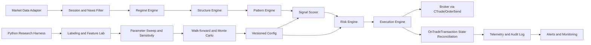
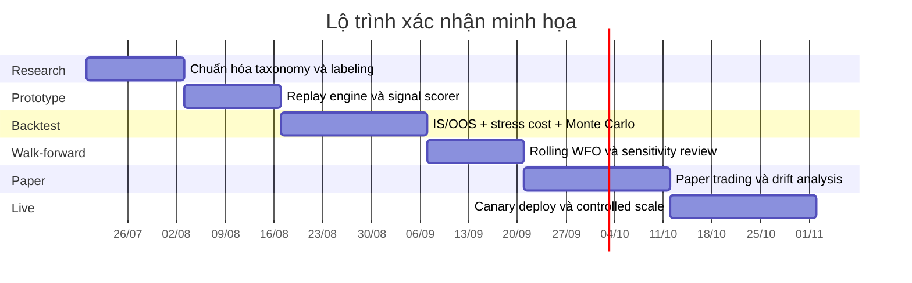

# Chuyển hóa báo cáo chiến lược thành thiết kế EA khung xương theo tư duy quant chuyên nghiệp

## Tóm tắt điều hành

Tài liệu nguồn hiện có trong phiên này không phải là một bài báo học thuật peer-reviewed, mà là một **research memo định hướng chiến lược** mang tên *Unicorn Precision Scalper*, nhắm đến mục tiêu pass prop firm, ưu tiên XAUUSD, dùng bias H4/Daily, structure M15 và entry M5/M1, với triết lý “ít lệnh nhưng xác suất cao”, rủi ro mỗi lệnh khoảng 0.25%–0.4% ở challenge và thấp hơn khi live. Memo này cũng đã tự khuyến nghị hướng đi **alert-first / semi-auto trước, chưa full-auto ngay** vì phần “quality judgment” của mô hình vẫn có tính chủ quan. Đây là điểm rất quan trọng để thiết kế EA đúng bản chất thay vì cố nhồi một logic discretionary thành máy tự động cứng nhắc. fileciteturn0file0L13-L19 fileciteturn0file0L69-L79 fileciteturn0file0L266-L273

Kết luận thiết kế ở mức chuyên nghiệp là: **không nên nhảy thẳng sang full-auto execution-only EA**. Kiến trúc hợp lý hơn là một hệ thống hai lớp: **Python research harness** để gắn nhãn, kiểm định giả thuyết, quét tham số và đánh giá robustness; và **MQL5 execution kernel** để vận hành trong MT5 với event loop nhẹ, deterministic, có pre-trade checks, state machine rõ ràng, giám sát realtime, circuit breakers và khả năng rollback. Cách phân lớp này phù hợp với cách MetaTrader 5 và MQL5 vận hành thực tế, đồng thời bám gần tư duy framework chuyên nghiệp kiểu **alpha → risk → execution** của LEAN. citeturn10view1turn4view0turn5view0turn5view2turn10view0

Từ góc nhìn lượng hóa, edge của memo nguồn có thể chuyển thành EA nếu anh xem nó như **một bài toán phát hiện mẫu có điều kiện**, không phải “một chỉ báo buy/sell”. Phần có thể cơ giới hóa tốt gồm: bias đa khung, session filter, news blackout, ATR/spread filter, liquidity sweep, MSS/BOS, displacement, geometry của FVG, overlap với breaker, premium/discount, stop/target logic và hard risk limits. Phần còn lại cần quản lý bằng cơ chế **confidence score**, **alert-only mode**, **human override**, hoặc **quarantine mode** khi độ chắc chắn dưới ngưỡng. fileciteturn0file0L90-L140 fileciteturn0file0L154-L166

Về kiểm định, em khuyến nghị dùng tiêu chuẩn cao hơn một backtest đẹp. Backtest phải chạy trên **Every Tick** hoặc **real ticks** khi có pending orders, stop logic và sensitivity với intrabar path; tester mode OHLC có thể tạo kết quả ảo. Đồng thời phải ghi lại toàn bộ trials tham số để giảm nguy cơ overfitting, và bổ sung các kiểm tra như walk-forward, stress cost, Monte Carlo, Deflated Sharpe logic và đánh giá độ nhạy tham số. citeturn7view2turn7view3turn22academia0turn23search0turn27academia4turn27academia5

Nếu phải chốt trong một câu: **EA nên bắt đầu ở dạng skeletal, event-driven, config-driven, alert-first, có scoring và risk layer riêng; chỉ nâng dần lên semi-auto rồi full-auto sau khi chứng minh được tính ổn định ngoài mẫu và ngoài môi trường backtest**. Mọi thứ khác đều là tối ưu hóa quá sớm. fileciteturn0file0L217-L243 fileciteturn0file0L247-L259

## Phạm vi và đánh giá tài liệu nguồn

Vì đề bài chưa chỉ định rõ **thị trường mục tiêu cuối cùng, broker live, loại tài khoản prop, danh mục instrument chính thức, timeframe vận hành cuối cùng, ngân sách dữ liệu/hạ tầng, latency budget, mức chấp nhận discretion và compliance constraints**, nên các nội dung đó phải được xem là **open-ended**. Trong report này, em lấy memo nguồn làm “base case” mặc định: XAUUSD là primary, EURUSD/GBPUSD là secondary, BTC/OIL là tertiary khi regime phù hợp; bias cao khung H4/Daily, entry M5/M1; session tập trung London/NY; risk-first hơn frequency-first. fileciteturn0file0L13-L19 fileciteturn0file0L28-L31 fileciteturn0file0L50-L56

Điểm mạnh lớn nhất của memo là nó đã có cấu trúc trader thực chiến khá rõ: confluence stack, asset customization, session filter, news filter, risk-first, daily/weekly loss caps, partials, breakeven, max-hold-time, và đặc biệt là cảnh báo không nên hype winrate. Đây là nền rất tốt cho EA vì nhiều quyết định đã được biến thành rule có thể kiểm tra bằng code. fileciteturn0file0L90-L140 fileciteturn0file0L247-L259 fileciteturn0file0L283-L295

Điểm yếu lớn nhất của memo là nó vẫn mang bản chất **practitioner research** chứ chưa phải research chuẩn lab. Các cụm như “quality of displacement”, “clear sweep”, “fresh FVG”, “mid-leg or weak”, “quality judgment” hàm ý còn vùng mờ về labeling. Chính memo cũng thừa nhận nguy cơ subjectivity, overfit, edge decay, khác biệt broker và variance thực thi, vì vậy thiết kế EA phải có **mức độ tự động hóa theo nấc**, không nên ép binary all-in/all-out. fileciteturn0file0L172-L179 fileciteturn0file0L193-L211

Bảng dưới đây là cách em “đọc” memo nguồn bằng con mắt quant.

| Trục đánh giá | Tài liệu nguồn hiện tại | Hàm ý cho EA |
|---|---|---|
| Bản chất nguồn | Research memo thực chiến | Dùng được cho design hypothesis, chưa đủ cho production proof |
| Tính cơ giới hóa | Trung bình đến khá | Tốt cho alert-first, semi-auto; full-auto cần thêm scoring layer |
| Tính đặc thù tài sản | Rất rõ | Bắt buộc config tách theo symbol/regime |
| Risk framework | Tốt | Có thể biến thành hard risk engine ngay |
| Khả năng backtest | Có thể | Phải chuẩn hóa khái niệm sweep/MSS/FVG overlap |
| Nguy cơ overfit | Có | Cần parameter hygiene, WFO, Monte Carlo, DSR |
| Nguy cơ execution drift | Cao trên Gold | Phải mô phỏng spread/slippage nghiêm ngặt |

Về mức tự động hóa, lựa chọn thực tế nhất là so sánh ba phương án sau.

| Phương án | Mô tả | Ưu điểm | Nhược điểm | Khuyến nghị |
|---|---|---|---|---|
| Alert-only EA | EA chỉ phát hiện setup, chấm điểm, cảnh báo | Giữ discretion ở đoạn khó; dễ debug; phù hợp giai đoạn đầu | Tốc độ scale chậm; phụ thuộc trader | **Khởi đầu nên dùng** |
| Semi-auto EA | EA đặt pending/market khi score cao, trader có veto hoặc toggle | Cân bằng giữa kỷ luật và tính linh hoạt | Cần UI/state management tốt | **Giai đoạn sau prototype** |
| Full-auto EA | EA tự vào/ra lệnh hoàn toàn | Tái lập 100%; giảm cảm xúc | Đòi hỏi rules cực sạch; dễ fail nếu labeling mờ | **Chỉ sau khi OOS + paper ổn** |

Khuyến nghị này không chỉ bám memo nguồn, mà còn phù hợp với cách MQL5 và các framework chuyên nghiệp tách **alpha, risk, execution** thành các mô-đun riêng, thay vì viết một khối `if-else` lớn trong `OnTick`. fileciteturn0file0L266-L273 citeturn10view0turn5view0

## Kiến trúc EA mục tiêu

Kiến trúc em đề xuất là **hybrid research-production architecture**: nghiên cứu và chuẩn hóa hypothesis ở ngoài terminal; còn execution và giám sát realtime nằm trong terminal. MQL5 rất phù hợp cho execution vì có `OnTick`, `OnTrade`, `OnTradeTransaction`, `CTrade`, `OrderCheck`, Economic Calendar, TesterStatistics và Python integration. Tuy nhiên, `OnTick` chỉ nên làm việc nhẹ vì hàng đợi event không tích chồng vô hạn; nếu đang xử lý một `NewTick`, tick mới có thể không được xếp thêm vào queue. Tương tự, `OnTradeTransaction` có hàng đợi 1024 phần tử, xử lý chậm có thể làm mất transaction cũ. Đây là lý do phải thiết kế **state machine nhẹ, không tính toán nặng trong runtime path**, và đẩy labeling/sweep tham số sang research layer. citeturn4view0turn7view0turn5view0turn5view2turn5view3turn10view1



Kiến trúc mô-đun nên có ranh giới rõ như sau.

| Mô-đun | Chức năng | Input | Output | Gợi ý API/chức năng |
|---|---|---|---|---|
| Market Data Adapter | Đồng bộ bar/tick/spread/session/calendar | ticks, bars, symbol info | normalized events | `OnTick`, `CopyRates`, `CopyTicks`, `SymbolInfo*` |
| Session & News Filter | Killzone, news blackout, rollover, spread gate | server time, calendar, spread | eligibility flag | Economic Calendar functions, trade server time |
| Regime Engine | ATR, ADX, vol percentile, HTF bias | HTF/LTF bars | regime state | indicator handles / cached features |
| Structure Engine | swing points, sweep, BOS/MSS/CHOCH | bar arrays | structure events | custom structural parser |
| Pattern Engine | breaker, FVG, overlap, PD array | structure + candles | candidate zone | config-driven geometry rules |
| Signal Scorer | deterministic gates + confidence score | all features | score, rationale | weighted score / logistic layer |
| Risk Engine | risk budget, size, hard limits | equity, stop distance, exposure | approved order ticket spec | `OrderCheck`, risk budget state |
| Execution Engine | limit/market, retry, slippage policy | approved order spec | trade request/result | `CTrade`, request/result metadata |
| State & Audit | state machine, journal, incident trail | all events | logs, snapshots | file/DB/CSV/JSON |
| Monitor & Alert | dashboard, notification, heartbeat | state deltas | alerts | `SendNotification`, terminal logs |

Bản thân MQL5 đã cung cấp một số mảnh ghép tầng execution rất sát nhu cầu. `CTrade` hỗ trợ mở vị thế, sửa lệnh, partial close, pending orders, lưu request/result gần nhất và chế độ asynchronous; `OrderCheck()` cho phép pre-flight margin/request validation trước khi gửi lệnh; Economic Calendar có sẵn trong nền tảng và dùng **trade server time**, không phải local time. Những chi tiết này giúp EA ổn định hơn rất nhiều so với kiểu “click là bắn lệnh”. citeturn5view0turn5view1turn5view2turn5view3

Một điểm em khuyến nghị mượn từ LEAN là tách luồng quyết định theo lớp: **Alpha model → Portfolio/Risk → Execution**. Trong tài liệu của QuantConnect, engine của họ stream dữ liệu từng lát thời gian, tránh look-ahead bias kiểu batch array, và chuyển targets từ alpha sang risk rồi mới sang execution. Tư duy đó rất nên mượn cho MT5, dù anh không dùng LEAN để live. citeturn10view0

### Giao diện nội bộ đề xuất

Ở mức skeletal, EA nên có giao diện nội bộ kiểu sau:

```text
IRegimeEngine::Update(barset) -> RegimeState
IStructureEngine::Parse(barset) -> StructureState
IPatternEngine::Find(structure, regime) -> list<CandidateZone>
ISignalScorer::Score(candidate, context) -> SignalDecision
IRiskEngine::Approve(signal, account_state) -> OrderPlan | RejectReason
IExecutionEngine::Execute(order_plan) -> ExecutionResult
IMonitor::Publish(event) -> void
```

Về mặt cài đặt, em khuyên dùng **config versioning** cho toàn bộ ngưỡng. Không hard-code tham số theo symbol trong source. Phải có `config.unicorn.xauusd.json`, `config.unicorn.eurusd.json`, `config.unicorn.gbpusd.json`, và một baseline chung. Cách này làm rollback, diff, audit và re-optimization sạch hơn.

## Mô hình định lượng và luật giao dịch

Muốn biến memo nguồn thành EA thật sự, phải đổi ngôn ngữ trader sang **ngôn ngữ feature engineering**. “Liquidity sweep” không thể để ở mức cảm tính; nó phải là biến đo được. “Displacement mạnh” phải có ngưỡng thân nến so với ATR hoặc z-score thân nến. “FVG overlap với breaker” phải có định nghĩa hình học. “Bias H4/Daily” phải ra được finite state machine. Memo nguồn đã nêu khá rõ những thành phần này, chỉ cần ép chúng vào schema định lượng. fileciteturn0file0L87-L121 fileciteturn0file0L235-L240

### Bộ feature đề xuất

| Nhóm feature | Feature cụ thể | Mô tả định lượng |
|---|---|---|
| Regime | ATR percentile, ADX, realized vol, spread percentile | Xác nhận thị trường có đủ “năng lượng” để pattern đáng tin |
| Session | London/NY killzone, time-to-news, rollover proximity | Chặn lệnh ngoài phiên và gần tin lớn |
| HTF bias | HH/HL vs LH/LL, close above/below HTF mid, HTF MSS | Quy về state `bull`, `bear`, `neutral` |
| Sweep | wick vượt prior high/low bao nhiêu point; đóng nến quay lại bao nhiêu % | Tách “quét thanh khoản” khỏi “break thật” |
| MSS/BOS | phá swing đối nghịch bằng close, không chỉ bằng wick | Tăng độ chặt cho structural change |
| Displacement | thân nến / ATR, range expansion, gap efficiency | Đo độ mạnh và tính “rời rạc” của move |
| FVG geometry | kích thước gap, freshness, fill ratio, overlap ratio | Chuẩn hóa vùng imbalance |
| Breaker geometry | vị trí candle gốc, invalidation edge, distance from sweep | Tạo vùng vào lệnh và stop logic |
| Premium/Discount | vị trí hiện tại so với dealing range / equilibrium | Filter bối cảnh |
| Micro-confirmation | rejection candle, CISD, response time trong zone | Giảm false entry |

Memo nguồn gợi ý rõ các ngưỡng gốc như: Gold cần ATR M5 cao hơn, spread max rộng hơn majors, FVG quality theo multiple của ATR, buffer stop khác nhau theo asset, max hold khác nhau theo asset, và DXY filter cho Gold. Những thứ đó không nên để trong một “indicator magic”; phải tách thành **asset profile**. fileciteturn0file0L50-L79

### Tham số hóa theo tài sản

| Tham số mặc định khởi tạo | XAUUSD | EURUSD / GBPUSD | BTCUSD |
|---|---:|---:|---:|
| Risk/trade challenge | 0.25%–0.35% | 0.35%–0.40% | 0.20% |
| SL buffer sơ bộ | 30–45 pips | 7–11 pips | 0.7%–1.0% |
| Min realized R:R | 2.5R | 2.0R | 2.0R |
| Max hold | 90 phút | 60 phút | 25 phút |
| Spread cap | 35 pips | 1.5 pips | 0.08% |
| Displacement filter | body > 1.8× ATR | body > 1.5× ATR | body > 2.0× ATR |

Bảng này không phải “chân lý”; nó là **prior** để khởi động calibration, trực tiếp dựa trên memo nguồn. Toàn bộ phạm vi tối ưu chỉ nên “light optimize”, đúng tinh thần nguồn: FVG body multiple, breaker lookback, overlap %, ATR threshold, buffer ±20%, killzone strictness ±15 phút. fileciteturn0file0L69-L79 fileciteturn0file0L235-L240

### Từ rule discretionary sang signal score

Em khuyên không dùng logic “đủ 8 điều kiện thì vào lệnh, thiếu 1 điều kiện thì bỏ”. Cách quant thực chiến hơn là **hai tầng**:

- **Tầng một**: hard gates không thương lượng, ví dụ session hợp lệ, không có high-impact news, spread trong ngưỡng, HTF bias không neutral, có sweep + MSS, có FVG overlap.
- **Tầng hai**: confidence score, chấm điểm cho chất lượng displacement, chất lượng overlap, độ gần HTF PD array, quality rejection/CISD, độ đồng thuận DXY, khoảng cách tới external liquidity.

Cách làm này phù hợp với bản chất strategy memo vì nó thừa nhận “rare high-probability setup” nhưng vẫn để chỗ cho chất lượng setup biến thiên, thay vì ép mọi lệnh thành cùng một loại. Đồng thời nó tạo lối đi tự nhiên từ alert-only sang semi-auto: score thấp thì chỉ cảnh báo, score cao mới cho phép auto-place. fileciteturn0file0L154-L166 fileciteturn0file0L205-L213

### Mẫu pseudo-logic cho signal engine

```pseudo
on_new_bar(symbol, timeframe):
    ctx = build_context(symbol)
    if not session_filter(ctx.time): return NO_SIGNAL
    if news_blackout(ctx.calendar_time): return NO_SIGNAL
    if spread_filter(ctx.spread, symbol): return NO_SIGNAL

    regime = regime_engine.update(ctx.htf_bars, ctx.ltf_bars)
    if regime.bias == NEUTRAL: return NO_SIGNAL

    structure = structure_engine.parse(ctx.ltf_bars)
    if not structure.has_valid_sweep: return NO_SIGNAL
    if not structure.has_mss_close: return NO_SIGNAL

    candidates = pattern_engine.find_unicorns(structure, ctx)
    if candidates.empty(): return NO_SIGNAL

    best = rank(candidates, ctx)
    score = signal_scorer.score(best, ctx)

    if score < ALERT_THRESHOLD:
        return NO_SIGNAL
    if score < AUTO_THRESHOLD:
        return ALERT_ONLY(best, score)

    return TRADE_PLAN(best, score, regime, ctx)
```

### Mẫu pseudo-logic cho pattern detector

```pseudo
find_unicorns(structure, ctx):
    for each swing_event after sweep:
        breaker = detect_breaker(swing_event)
        fvg = detect_fvg_from_displacement(swing_event)

        if breaker.invalid or fvg.invalid:
            continue

        overlap_ratio = overlap(fvg.range, breaker.range)
        body_atr = displacement_body / atr(ctx.entry_tf)
        fill_ratio = fvg_filled_portion(fvg)

        if overlap_ratio < cfg.min_overlap: continue
        if body_atr < cfg.min_body_atr: continue
        if fill_ratio > cfg.max_fvg_fill: continue
        if not premium_discount_ok(ctx, breaker.direction): continue

        emit candidate
```

Điểm mấu chốt là detector phải **log được lý do reject**. Một EA nghiêm túc không chỉ cần biết vì sao vào lệnh, mà còn phải biết vì sao bỏ lệnh. Nhờ vậy anh mới audit được false negatives và không bị “ảo giác edge” do nhớ mỗi lệnh đẹp.

## Quản trị rủi ro, sizing, thực thi và giám sát

Tài liệu nguồn có risk framework khá tốt để biến thành **hard constraints**: fixed fractional risk theo equity, max daily loss, max weekly loss, soft overall drawdown pause, hard overall stop, không martingale, không average down, dừng ngày khi có hai lệnh thua liên tiếp, no weekend/no overnight cho bối cảnh prop. Những luật này nên sống trong `RiskEngine`, tuyệt đối không nằm rải rác trong `SignalEngine`. fileciteturn0file0L247-L259

Về tư duy đo lường, đừng chỉ nhìn Sharpe. Chính literature về Sharpe nhấn mạnh rằng Sharpe thực nghiệm chịu sai số ước lượng và nhạy với autocorrelation; còn drawdown là thước đo path-dependent, nhạy với serial correlation hơn volatility thông thường. Vì vậy acceptance set phải có cả Sharpe, max drawdown, CAGR, profit factor, expectancy, số lệnh, MAE/MFE, hold time, skew của trade PnL, và mức tập trung lợi nhuận. citeturn27academia4turn27academia5turn15academia1

### Thuật toán sizing khuyến nghị

| Thuật toán | Công thức lõi | Khi dùng | Khuyến nghị thực tế |
|---|---|---|---|
| Fixed fractional | `risk$ = equity * risk_pct` | Mặc định | **Chuẩn production ban đầu** |
| Volatility-scaled fractional | `risk_pct_adj = base_risk * target_vol / realized_vol` | Khi regime thay đổi mạnh | Dùng cho multi-asset |
| Capped fractional Kelly | `size = min(cap, shrink * Kelly_est)` | Chỉ sau khi edge ổn định OOS | Dùng rất thận trọng |
| Hard-contract cap | `size = min(size_model, max_contracts_by_symbol)` | Bảo vệ tail risk | Bắt buộc ở prop/live |

Sizing mặc định nên là **fixed fractional có tính đến chi phí thực thi**, chứ không phải chỉ dùng stop distance thuần. Công thức thực dụng là:

```text
risk_amount = equity * risk_pct
effective_stop_cost = stop_distance_points * point_value + est_slippage + est_commission
position_size = floor_to_lot_step(risk_amount / effective_stop_cost)
```

Với Kelly, nếu có dùng thì chỉ dùng như **fractional Kelly đã shrink mạnh**, vì Kelly rất nhạy với lỗi ước lượng edge và variance; còn overfitting/backtest selection bias có thể làm ước lượng edge “phồng giả”. citeturn24search5turn22academia0turn23search0

### Logic thực thi và handling slippage/latency

Trong literature về execution, bài toán luôn là trade-off giữa **market impact / execution cost** và **volatility risk khi chờ khớp**. Với một strategy intraday ngắn như UPS, câu trả lời thực dụng không phải là “luôn market” hay “luôn limit”, mà là policy theo bối cảnh. Nếu displacement còn đang lan mạnh, ưu tiên chờ retrace có điều kiện vào limit; nếu score rất cao nhưng zone chạm xong phản ứng đóng nến rõ, cho phép market-on-confirm với deviation cap. citeturn0academia0turn0academia2turn0academia3

Bên trong MT5, `CTrade` hỗ trợ market và pending orders, còn `SetDeviationInPoints`, `SetTypeFilling*`, `SetAsyncMode`, partial close và request/result inspection cho phép xây một execution policy có kiểm soát. `OrderCheck()` nên chạy trước mọi request để chặn lỗi margin/invalid request ngay từ đầu. citeturn5view0turn5view1turn5view2

Em đề xuất execution policy như sau:

| Tình huống | Hành động |
|---|---|
| Score rất cao, zone chưa chạm, spread ổn | Đặt limit tại CE/FVG midpoint kèm expiry ngắn |
| Score cao, zone chạm và có confirmation candle | Market-on-close với deviation cap |
| Spread nới quá ngưỡng | Cancel / không vào |
| Slippage thực tế > slippage budget | Huỷ hoặc giảm size ở lệnh kế tiếp trong phiên |
| Lệnh pending chưa fill sau `n` bars | Hết hạn |
| Sau fill mà adverse excursion quá nhanh | Không re-enter cùng setup trong cùng killzone |

Trong runtime, `OnTick` chỉ nên cập nhật state, không nên scan lại lịch sử quá dài. Mọi thứ có thể thì chạy **new-bar gated**. `OnTradeTransaction` chỉ làm reconciliation, cập nhật state lệnh, ghi audit tối giản; vì tài liệu chính thức cảnh báo queue transaction có giới hạn và event có thể đến theo nhiều bước cho một lần request. citeturn4view0turn7view0turn7view1

### Monitoring và alerting

Monitoring production của EA nên chia làm ba lớp:

| Lớp | Mục tiêu | Kênh |
|---|---|---|
| Health | heartbeat, data freshness, event lag, calendar sync | terminal log + push |
| Trading | entry/exit, partials, stop-move, rejected orders | push + structured logs |
| Risk | daily loss, exposure, drawdown, kill-switch, symbol lockout | push + dashboard |

MQL5 hỗ trợ `SendNotification()` để đẩy push sang mobile terminal, nhưng có giới hạn tần suất và **không hoạt động trong Strategy Tester**. `Alert()` cũng không hoạt động trong tester. Nghĩa là trong backtest/paper harness, anh phải dùng logger/stub thay vì tin vào popup hay push. Đây là chi tiết nhỏ nhưng nếu bỏ qua thì anh sẽ test một hệ thống monitoring “giả”. citeturn20view0turn20view1turn6view0

### Mẫu pseudo-logic cho risk và kill-switch

```pseudo
before_send(order_plan):
    if daily_loss_pct <= -cfg.max_daily_loss: return HARD_BLOCK
    if weekly_loss_pct <= -cfg.max_weekly_loss: return HARD_BLOCK
    if account_dd_pct <= -cfg.hard_account_dd: return KILL_SWITCH
    if consecutive_losses >= cfg.max_consecutive_losses: return SOFT_BLOCK
    if symbol_trades_today >= cfg.max_trades_per_symbol: return BLOCK
    if killzone_trades >= 1 and cfg.one_trade_per_killzone: return BLOCK

    check = order_check(order_plan)
    if not check.ok: return BLOCK

    return ALLOW
```

## Vòng đời phát triển, kiểm thử và tiêu chí chấp nhận

MetaTrader 5 có Strategy Tester với các mode tick khác nhau, hỗ trợ real ticks, multi-currency testing, và `TesterStatistics()` để lấy trực tiếp các thống kê trong tester. Nhưng tài liệu chính thức cũng cảnh báo rất rõ: mode OHLC và Open Prices Only có thể tạo “testing grail” cho những chiến lược nhạy với intrabar path; còn testing trên real ticks là gần điều kiện thật nhất. Vì UPS dùng pending logic, stop logic, spread filter, session timing và phản ứng intrabar, em xem **Every Tick / real ticks** là bắt buộc ở giai đoạn xác nhận. citeturn6view0turn7view2turn7view3turn21view0

Bản memo nguồn tự đề xuất mục tiêu validation khá rõ: in-sample 01/2024–06/2025, out-of-sample 07/2025–07/2026, walk-forward 3 tháng, Gold slippage 8–15 pips, targets sau cost gồm winrate 55%–68%, PF ≥ 1.8, Gold PF ≥ 2.0, MaxDD < 5.5%, expectancy ≥ 0.45R, realized R:R ≥ 1:2.2, 8–20 trades/tháng. Em xem đây là **acceptance prior** rất hợp lý để khởi động, không phải chân lý bất biến. fileciteturn0file0L219-L240

### Ma trận pha phát triển

| Pha | Mục tiêu | Checklist bắt buộc | Test plan | Metrics chính | Acceptance |
|---|---|---|---|---|---|
| Research | Chuẩn hóa rule và taxonomy | Định nghĩa sweep/MSS/FVG/breaker bằng công thức; asset profiles; session/news rules | Manual labeling 100–200 mẫu | inter-annotator agreement, ambiguity count | Không còn rule mơ hồ chặn code |
| Prototyping | Dựng signal engine + replay | Replay chart, explainable logs, reject reasons | Unit test + bar replay | precision/recall trên labeled set | ≥ 80% khớp labeling chuẩn ở setup hạng A |
| Backtest | Ước lượng edge sau cost | Every Tick/real ticks, commission, variable spread, slippage | IS + OOS + stress cost | Sharpe, PF, MDD, CAGR, expectancy, trade stats | Đạt ngưỡng memo hoặc sát ngưỡng |
| Walk-forward | Đo độ bền theo thời gian | Refit schedule cố định, không backfit tay | rolling WFO | degradation ratio, parameter stability | OOS không xấu đi quá ~30% so với IS |
| Paper trading | Đo execution drift | Live paper, log full transactions, alerts, kill-switch test | 4–8 tuần | fill quality, reject rate, live vs expected slippage | Drift nằm trong budget |
| Live deployment | Rollout kiểm soát | canary size, rollback plan, runbook | staged live | realized DD, infra uptime, incident count | Không vi phạm hard risk/ops thresholds |

### Bảng chỉ tiêu đánh giá

| Nhóm | Chỉ tiêu | Cách đọc |
|---|---|---|
| Hiệu suất | CAGR | Tốc độ tăng trưởng kép |
| Hiệu suất điều chỉnh rủi ro | Sharpe | So excess return với volatility; phải đọc cùng autocorrelation caveat |
| Rủi ro đường vốn | Max Drawdown | Peak-to-trough lớn nhất |
| Chất lượng lợi nhuận | Profit Factor | Tổng lời / tổng lỗ |
| Chất lượng lệnh | Expectancy (R) | Kỳ vọng mỗi lệnh |
| Microstructure | Avg slippage, reject rate | Độ lệch giữa backtest và live |
| Tính ổn định | % profitable months, parameter drift | Độ bền theo thời gian |
| Trade-level | winrate, avg win/loss, MAE, MFE, hold time | Chẩn đoán cơ chế chiến lược |

Một quant nghiêm túc nên ghi **tất cả trial** để dùng Deflated Sharpe Ratio hoặc tối thiểu là trial accounting; vì nếu quét nhiều cấu hình mà chỉ giữ “best run”, khả năng dính selection bias rất cao. Quan điểm này khớp với các nghiên cứu về backtest overfitting và với chính khuyến nghị trong memo nguồn là “light optimize only”. citeturn23search0turn22academia0turn23academia2 fileciteturn0file0L235-L240



*Mốc thời gian trên chỉ là minh họa trình tự; effort và lịch thật hiện vẫn chưa được chỉ định.*

## Ứng phó sự cố, cộng đồng, công cụ và roadmap triển khai

Một EA production-grade không chỉ có strategy logic; nó cần **failure design**. Với UPS-style intraday FX/Gold, failure modes thường rơi vào bảy nhóm: data gap, calendar/timezone lệch, spread spike, duplicate/frozen state, slippage burst, parameter drift, và behavioral drift do regime shift. Memo nguồn cũng đã cảnh báo execution variance, broker difference, regime shift, overfit risk và psychology drift; em chuyển thẳng các cảnh báo đó thành hệ thống fallback bên dưới. fileciteturn0file0L170-L179

### Bảng failure modes và fallback plans

| Failure mode | Dấu hiệu | Phản ứng ngay | Kế hoạch fallback |
|---|---|---|---|
| Data stale / missing ticks | bar không cập nhật đúng session | block new entries | khởi động lại adapter, chuyển alert-only |
| Calendar lệch timezone | news blackout sai lệch | block trade quanh all high-impact windows | resync theo trade server time |
| Spread spike | spread > cap hoặc spread percentile cực đoan | cancel pending / block entry | lock symbol đến hết killzone |
| Slippage burst | slippage thực > budget liên tiếp | giảm size 50% hoặc block | chuyển limit-only hoặc alert-only |
| Order state mismatch | pending/position không khớp local state | reconcile bằng `OnTradeTransaction` + position scan | emergency flatten nếu không giải quyết được |
| Drawdown breach | soft/hard DD hit | soft pause / kill-switch | review, rollback config trước đó |
| Parameter drift | OOS degrade kéo dài | quarantine config | re-optimize có kiểm soát trên window mới |
| Broker/execution anomaly | nhiều rejected orders, requotes | switch mode block | đổi broker/liquidity profile sau review |

### Quy trình incident response và debugging

| Bước | Nội dung |
|---|---|
| Detect | Alert từ health/risk/trading monitor |
| Triage | Phân loại: strategy bug, data bug, execution bug, broker bug |
| Contain | Block symbol / block session / full kill-switch |
| Diagnose | Trích trade audit, request/result, spread, tick snapshot, config hash |
| Recover | Rollback config hoặc restart module |
| Review | Post-mortem 1 trang: nguyên nhân gốc, blast radius, preventive action |

Trong MT5, `OnTradeTransaction` là điểm neo tốt nhất để audit request/result và reconcile trạng thái; còn `TesterStatistics()` cho phép kéo ra các thống kê tối thiểu trong tester hoặc `OnTester`. Phần logging production nên tách hai mức: **structured trade log** và **human-readable narrative log**. citeturn7view0turn21view0

### Cộng đồng và cách tích hợp tín hiệu cộng đồng

Nguồn cộng đồng có ích để tìm hypothesis mới, nhưng không bao giờ được đưa thẳng vào EA như một “truth feed”. Cách đúng là dựng **community hypothesis pipeline**:

| Bước | Cách làm |
|---|---|
| Thu thập | Lấy ý tưởng theo topic: entry logic, filter, execution tweak, prop compliance |
| Chuẩn hóa | Chuyển mỗi ý tưởng thành hypothesis card: “nếu X thì Y vì Z” |
| Chấm nguồn | Điểm độ tin cậy theo tác giả, lịch sử, tính tái lập, mức minh bạch dữ liệu |
| Kiểm chứng | Replay và backtest nhỏ ngoài mẫu, không tối ưu lan man |
| Hợp nhất | Chỉ merge khi cải thiện OOS và không làm nặng structure |
| Quarantine | Ý tưởng chưa đủ bằng chứng chỉ sống trong sandbox config |

Danh sách nguồn nên chia theo **nguồn học được ý tưởng** và **nguồn dùng để xác minh**. Với tiếng Việt, nguồn cộng đồng đáng theo dõi nhất trong phạm vi trader retail/practitioner là **TraderViet**, vì đây là diễn đàn tiếng Việt lớn, có các khu vực riêng cho Forex/Vàng, Trade Quỹ và Hệ thống giao dịch. Với tiếng Anh, nên ưu tiên **MQL5 forum** cho thực thi EA/MT5, **Quantitative Finance Stack Exchange** cho câu hỏi định lượng và mô hình, **QuantConnect forum/Discussions** cho research framework, rồi mới đến **r/algotrading** và **Forex Factory** như nguồn idea-flow, không phải nguồn chứng thực. citeturn18view3turn18view0turn18view1turn19view0turn19view2turn31view0turn31view1

### Công cụ, thư viện và dữ liệu khuyến nghị

Bảng dưới đây tổng hợp lựa chọn công cụ dựa trên tài liệu chính thức của MQL5, Backtrader, vectorbt, QuantConnect, Alpha Vantage, Massive và Dukascopy. citeturn10view1turn10view3turn10view2turn10view0turn11view0turn12view0turn12view2

| Nhóm | Lựa chọn | Vai trò | Ưu tiên |
|---|---|---|---|
| Runtime execution | MQL5 / MetaTrader 5 | Live execution, broker-native EA | **Rất cao** |
| Research bridge | MetaTrader5 Python package | Kéo data từ terminal sang Python | **Rất cao** |
| Fast param sweep | vectorbt | Quét nhiều cấu hình cực nhanh | Cao |
| Event-driven prototype | Backtrader | Dễ dựng strategy / analyzers / sizing | Cao |
| Framework tham chiếu | QuantConnect LEAN | Học module hóa alpha-risk-exec | Trung bình |
| Data macro & indicators | Alpha Vantage | FX, commodities, economic indicators, tech indicators | Trung bình |
| Forex tick/historical | Massive / Polygon Forex | Tick-level FX research | Trung bình-cao |
| Historical export bổ sung | Dukascopy | Tải historical forex data | Trung bình |
| Monitoring | MT5 push + logs + dashboard ngoài | Alerting và audit | Rất cao |

Nếu chỉ chọn **một stack tối thiểu**, em chọn:

- **MQL5 + MT5 Strategy Tester** cho execution và validation nội terminal. citeturn6view0turn21view0
- **Python + MetaTrader5 package + vectorbt** cho research và sensitivity. citeturn10view1turn10view2
- **Backtrader** nếu anh muốn replay/event-driven prototype dễ đọc hơn trước khi port logic sang MQL5. citeturn10view3

### Mẫu MQL5 EA skeleton tối giản

```cpp
// Skeleton hướng kiến trúc, không phải mã production hoàn chỉnh
#include <Trade/Trade.mqh>
CTrade trade;

int OnInit() {
   // load config, init indicators, init state, warmup calendar/timers
   return(INIT_SUCCEEDED);
}

void OnTick() {
   if(!IsNewBar(_Symbol, PERIOD_M5)) return;

   Context ctx = BuildContext(_Symbol);
   if(!SessionAndNewsOK(ctx)) return;

   SignalDecision sig = EvaluateSignal(ctx);
   if(sig.mode == SIGNAL_NONE) return;

   if(sig.mode == SIGNAL_ALERT_ONLY) {
      PublishAlert(sig);
      return;
   }

   OrderPlan plan = RiskApprove(sig, ctx);
   if(!plan.approved) {
      LogReject(plan.reason);
      return;
   }

   if(!PreflightCheck(plan)) return;
   ExecutePlan(plan);
}

void OnTradeTransaction(const MqlTradeTransaction& trans,
                        const MqlTradeRequest& request,
                        const MqlTradeResult& result) {
   ReconcileState(trans, request, result);
   PublishTradeEvent(trans, request, result);
}

void OnTimer() {
   HealthCheck();
   RiskHeartbeat();
}
```

### Roadmap triển khai ưu tiên

| Ưu tiên | Hạng mục | Deliverable | Effort |
|---|---|---|---|
| P0 | Chuẩn hóa taxonomy UPS | glossary + labeling rules + reject reasons | Chưa xác định |
| P0 | Xây signal replay harness | replay notebook + exported examples | Chưa xác định |
| P0 | Dựng MT5 alert-first skeleton | EA cảnh báo + structured logs | Chưa xác định |
| P1 | Backtest IS/OOS + stress cost | report metrics + sensitivity map | Chưa xác định |
| P1 | Walk-forward + Monte Carlo | validation pack | Chưa xác định |
| P1 | Paper trading bridge | live paper telemetry + incident runbook | Chưa xác định |
| P2 | Semi-auto order placement | pending/market policies + safety guards | Chưa xác định |
| P2 | Community hypothesis pipeline | hypothesis registry + source scoring | Chưa xác định |
| P3 | Full-auto canary deploy | feature flags + rollback + post-trade analytics | Chưa xác định |

Ưu tiên chiến lược rõ nhất là: **đừng code full-size EA trước khi taxonomy của pattern đã sạch**. Nếu pattern definition chưa sạch, mọi tối ưu hóa execution chỉ là tối ưu cho lỗi gắn nhãn.

### Kết luận thực dụng

Nếu em phải chốt bản thiết kế skeletal đủ chắc để anh triển khai, em sẽ chốt như sau: lấy **UPS memo làm hypothesis source**, dùng **asset-profile tách riêng**, vận hành **alert-first EA trên MT5**, xây **research harness bằng Python**, áp dụng **hard risk engine độc lập**, test trên **Every Tick/real ticks**, theo dõi bằng **structured telemetry + kill-switch**, chỉ nâng mức tự động hóa khi qua đủ **backtest, walk-forward, paper drift** và không vi phạm các ngưỡng drawdown/robustness đã định. Điều đó vừa trung thành với tinh thần risk-first của memo nguồn, vừa đúng với kỷ luật của một quant sống được ngoài thị trường. fileciteturn0file0L217-L243 fileciteturn0file0L247-L273 citeturn7view2turn7view3turn22academia0turn23search0turn10view0turn5view2